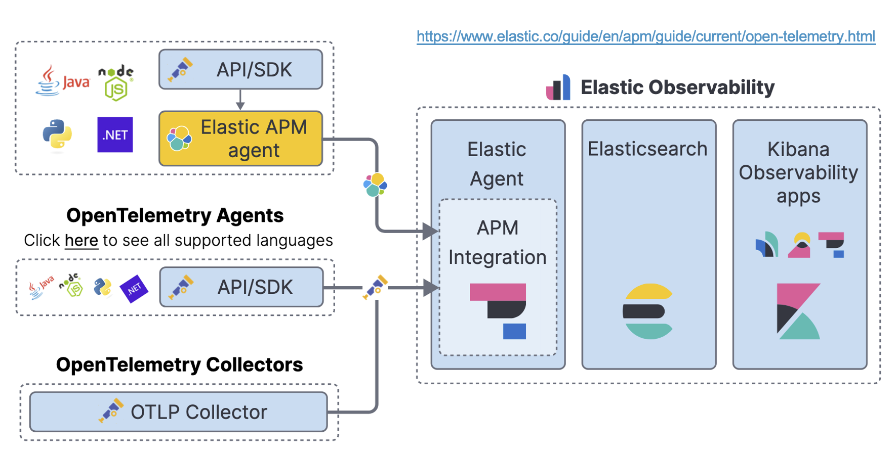
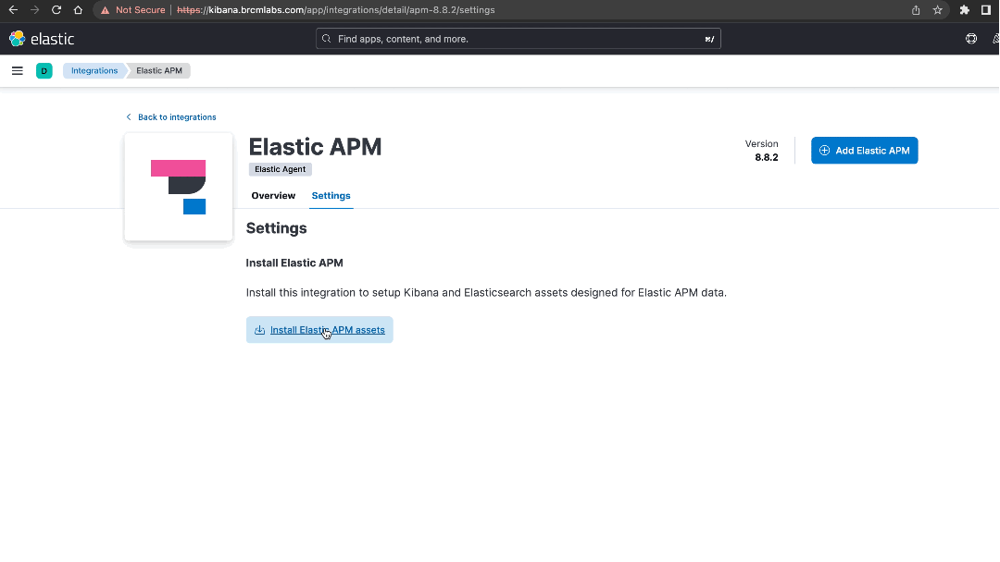
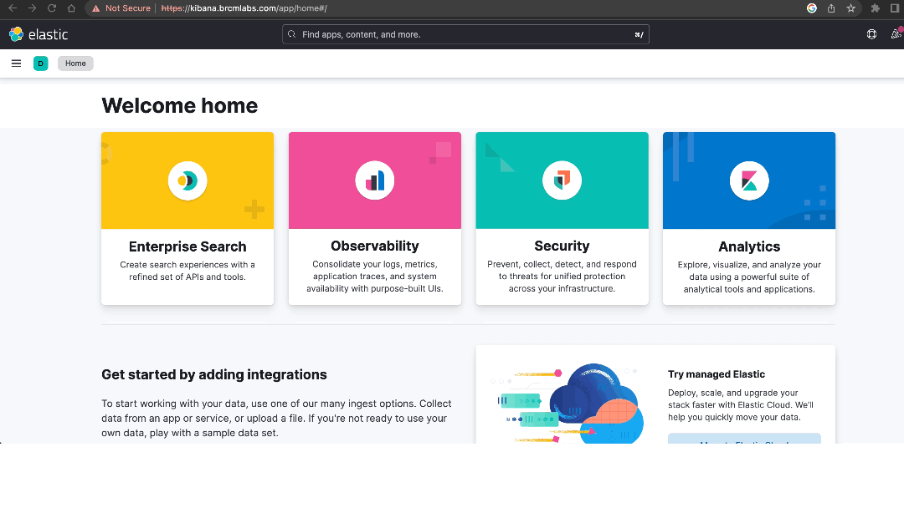

# Open Telemetry Integration (Elastic Stack - ECK (Elastic Cloud on Kubernetes))
By the end of this example you should have a better understanding of the how to utilise the Gateway's Open Telemetry integration to increase observability across your Operator Managed Gateways. This example uses a Simple Gateway as a base and includes installing the following.

- CertManager Operator (required for OTel)
- OpenTelemetry Operator
- Elastic Stack
  - Elastic Search
  - Elastic Agent
  - Elastic APM
  - Filebeat
  - MetricBeat
  - Kibana
- Nginx (Ingress Controller)

### Elastic Stack Note
This example creates a single [Elastic Search](./components/es.yaml) node with a 100GB volume. This is not production ready implementation, please refer to the [Official Elastic Documentation](https://www.elastic.co/guide/en/cloud-on-k8s/current/index.html) for sizing guidelines and additional configuration options.

### OpenTelemetry and Elastic APM
In this example we use an OTel collector to send telemetry data to Elastic APM.


### Elastic Beats
We make use of Filebeat for container log files (the Gateway + everything else) and Metricbeat for Kubernetes metrics. Neither of these components are required if you are solely interested in Gateway Application Telemetry.


## Prerequisites
- Kubernetes v1.25+
- Gateway v10/11.x License
- Ingress Controller (for kibana)

This OTel Elastic Example requires multiple namespaces for the additional components. Your Kubernetes user or service account must have sufficient privileges to create namespaces, deployments, configmaps, secrets, service accounts, roles, etc.

***NOTE:*** to keep things simple we use the default namespace when creating namespaced resources including the Layer7 Operator, Gateway, Repositories and Elastic Stack resources. If you'd like to use a different namespace then you will need to update the following.

- [agent.yaml](./components/agent.yaml)
```
apiVersion: rbac.authorization.k8s.io/v1
kind: ClusterRoleBinding
metadata:
  name: elastic-agent
subjects:
- kind: ServiceAccount
  name: elastic-agent
  namespace: default <==
roleRef:
  kind: ClusterRole
  name: elastic-agent
  apiGroup: rbac.authorization.k8s.io
```

- [filebeat.yaml](./components/filebeat.yaml)
```
apiVersion: rbac.authorization.k8s.io/v1
kind: ClusterRoleBinding
metadata:
  name: filebeat
subjects:
- kind: ServiceAccount
  name: filebeat
  namespace: default <==
roleRef:
  kind: ClusterRole
  name: filebeat
  apiGroup: rbac.authorization.k8s.io
```

- [metricbeat.yaml](./components/metricbeat.yaml)
```
apiVersion: rbac.authorization.k8s.io/v1
kind: ClusterRoleBinding
metadata:
  name: metricbeat
subjects:
- kind: ServiceAccount
  name: metricbeat
  namespace: default <==
roleRef:
  kind: ClusterRole
  name: metricbeat
  apiGroup: rbac.authorization.k8s.io
```

- [collector.yaml](./collector.yaml)
```
otlp/elastic:
  endpoint: apm-server-quickstart-apm-http.<namespace>.svc.cluster.local:8200
```

- Update your Kubectl context
```
kubectl config set-context --current --namespace=yournamespace
```

If you have a docker machine available you can use [Kind](https://kind.sigs.k8s.io/) to try out this example!

### Getting started
1. Place a gateway v10 or v11 license in [base/resources/secrets/license/](../base/resources/secrets/license/) called license.xml.
2. Accept the Gateway License
  - license.accept defaults to false in [Gateway examples](../gateway/otel-elastic-gateway.yaml)
  - update license.accept to true before proceeding
  ```
  license:
    accept: true
    secretName: gateway-license
  ```
3. If you would like to create a TLS secret for your ingress controller then add tls.crt and tls.key to [base/resources/secrets/tls](../base/resources/secrets/tls)
    - these will be referenced later on.
4. You will need an ingress controller like nginx
    - if you do not have one installed already you can use the makefile in the example directory to deploy one
        - ```cd example```
        - Generic Kubernetes
            - ```make nginx```
        - Kind (Kubernetes in Docker)
            - follow the steps in Quickstart
            or
            - ```make nginx-kind```
    - return to the previous folder
        - ```cd ..```


### Gateway Configuration
- [Container Gateway](#container-gateway-configuration)
- [OTel Collector](#otel-collector-configuration)
- [Service Level](#service-level-configuration)

### Guide
- [Quickstart Kind](#quickstart-kind)
- [Quickstart Existing Kubernetes Cluster](#quickstart-existing-cluster)

## Note:
If you use Quickstart you do not need to install/deploy any additional resources

### Monitoring/Observability Components
- [Install Cert Manager](#install-cert-manager)
- [Install Open Telemetry](#install-open-telemetry)
- [Install an Ingress Controller(optional)](#install-nginx)
- [Install the Elastic Stack](#install-the-elastic-stack)
- [Install APM Components (Kibana UI)](#elastic-post-installation-tasks)

### Layer7 Operator
- [Deploy the Operator](#deploy-the-layer7-operator)
- [Create Repositories](#create-repository-custom-resources)
- [Create a Gateway](#create-a-gateway-custom-resource)
- [Test Gateway Deployment](#test-your-gateway-deployment)
- [Remove Custom Resources](#remove-custom-resources)
- [Uninstall the Operator CRs](#uninstall-the-operator)

### Container Gateway Configuration
The container gateway configuration required for this integration is relatively simple. We will set some environment variables in our OTel [instrumentation](./instrumentation.yaml) that the Otel Agent present on the Container Gateway will use to send logs, traces and metrics to the Otel Collector sidecar.

```
apiVersion: opentelemetry.io/v1alpha1
kind: Instrumentation
metadata:
  name: otel-instrumentation
spec:
  env:
    - name: OTEL_SERVICE_NAME
      value: ssg
    - name: OTEL_METRICS_EXPORTER
      value: otlp
    - name: OTEL_TRACES_EXPORTER
      value: otlp
    - name: OTEL_RESOURCE_ATTRIBUTES
      value: service.version=11.1.1,deployment.environment=development
  exporter:
    endpoint: http://localhost:4317
  propagators:
    - tracecontext
    - baggage
    - b3
  sampler:
    type: parentbased_traceidratio
    argument: "0.25"
```

### OTel Collector Configuration
The OpenTelemetry Operator will automatically inject a sidecar into the Gateway Pod with our [OTel configuration](./collector.yaml). This configuration exposes a /metrics endpoint on the Gateway Pod on port 8889 for Prometheus to scrape.

```
receivers:
  otlp:
    protocols:
      grpc:
        endpoint: 0.0.0.0:4317
      http:
        endpoint: 0.0.0.0:4318
processors:
  batch:
  resource:
    attributes:
    - key: layer7gw.name
      value: "ssg"
      action: upsert
exporters:
  debug:
    verbosity: basic
  otlp/elastic:
    endpoint: apm-server-quickstart-apm-http:8200
    tls:
      insecure_skip_verify: true
    headers:
      Authorization: "Bearer APM_AUTH_TOKEN"
service:
  telemetry:
    logs:
      level: "debug"
    metrics:
      address: "0.0.0.0:8888"
  pipelines:
    traces:
      receivers: [otlp]
      processors: [resource,batch]
      exporters: [otlp/elastic]
    metrics:
      receivers: [otlp]
      processors: [resource,batch]
      exporters: [otlp/elastic,debug]
    logs: 
      receivers: [otlp]
      exporters: [otlp/elastic, debug]
```

### Service Level Configuration
This integration uses the background metrics processing task to capture Gateway Metrics and present them in the Kibana Dashboard. The Restman Bundle [here](../base/resources/secrets/bundles/telemetry.bundle) is bootstrapped to this Gateway Deployment.


### Gateway Application Configuration
The Gateway has OTel specific configuration. 

- Pod Annotations
```
  app:
    podAnnotations:
      sidecar.opentelemetry.io/inject: "ssg-prom" <== this injects the OpenTelemetryCollector sidecar
      instrumentation.opentelemetry.io/inject-java: "true" <== this loads the OpenTelemetry Java agent onto the Gateway
      instrumentation.opentelemetry.io/container-names: "gateway" <== this defines which container the Java Agent is loaded onto
```

- Cluster-Wide Properties
```
cwp:
  enabled: true
  properties:
    ...
    - name: otel.enabled
      value: "true"
    - name: otel.serviceMetricEnabled
      value: "true"
    - name: otel.traceEnabled
      value: "true"
    - name: otel.metricPrefix
      value: l7_
    - name: otel.traceConfig
      value: |
        {
          "services": [
            {"resolutionPath": ".*"}
          ]
        }
```

- System Properties
```
system:
  properties: |-
    ...
    # OpenTelemetry Agent Configuration
    otel.instrumentation.common.default-enabled=true
    otel.instrumentation.opentelemetry-api.enabled=true
    otel.instrumentation.runtime-metrics.enabled=true
    otel.instrumentation.runtime-telemetry.enabled=true
    otel.instrumentation.opentelemetry-instrumentation-annotations.enabled=true
    otel.java.global-autoconfigure.enabled=true
    # Additional properties go here
```

### Quickstart Kind
A Makefile is included in the example directory that makes deploying this example a one step process. If you have access to a Docker Machine you can use [Kind](https://kind.sigs.k8s.io/) (Kubernetes in Docker). This example can optionally deploy a Kind Cluster for you (you just need to make sure that you've [installed Kind](https://kind.sigs.k8s.io/docs/user/quick-start/#installation))

The kind configuration is in the base of the example folder. If your docker machine is remote (you are using a VM or remote machine) then uncomment the network section and set the apiServerAddress to the IP address of your VM/Remote machine
```
kind: Cluster
apiVersion: kind.x-k8s.io/v1alpha4
# networking:
#   apiServerAddress: "192.168.1.64"
#   apiServerPort: 6443
nodes:
- role: control-plane
  kubeadmConfigPatches:
  - |
    kind: InitConfiguration
    nodeRegistration:
      kubeletExtraArgs:
        node-labels: "ingress-ready=true"
  extraPortMappings:
  - containerPort: 80
    hostPort: 80
    protocol: TCP
  - containerPort: 443
    hostPort: 443
    protocol: TCP
```

This process takes a few minutes to complete

- Add the following entries to your hosts file
<b>IMPORTANT:</b> ***if you're using a remote docker engine for Kind the IP address will need to match what you have configured in [kind-config.yaml](../kind-config.yaml)***
```
127.0.0.1 gateway.brcmlabs.com kibana.brcmlabs.com
```
- navigate to the example directory
```
cd example
```
- deploy the example
```
make kind-cluster otel-elastic-example-kind
```

- wait for all components to be ready
```
watch kubectl get pods
```
output
```
NAME                                                  READY   STATUS    RESTARTS        AGE
apm-server-quickstart-apm-server-7f4bd7d5d-z5gll      1/1     Running   0               6m20s
elastic-agent-agent-zc9wr                             1/1     Running   0               6m23s
filebeat-beat-filebeat-zxxkv                          1/1     Running   3 (5m11s ago)   6m20s
layer7-operator-controller-manager-69dc945d66-b75lw   2/2     Running   0               7m29s
metricbeat-beat-metricbeat-5xrkh                      1/1     Running   3 (5m18s ago)   6m20s
quickstart-es-default-0                               1/1     Running   0               6m23s
quickstart-kb-786fc5c8d9-5c7bh                        1/1     Running   0               6m21s
ssg-c698b5fcd-6k7fh                                   2/2     Running   0               3m51s
ssg-c698b5fcd-6wc6m                                   2/2     Running   0               4m5s
```

There are some additional setup steps for Elastic
- [Install APM Components](#install-apm-components)

You can now move on to test your gateway deployment!
- [Test Gateway Deployment](#test-your-gateway-deployment)

### Quickstart Existing Cluster
This quickstart uses the Makefile to install of the necessary components into your Kubernetes Cluster. This process takes a few minutes to complete

- Add the following entries to your hosts file
<b>IMPORTANT:</b> ***if you're using a remote docker engine for Kind the IP address will need to match what you have configured in [kind-config.yaml](../kind-config.yaml)***
```
127.0.0.1 gateway.brcmlabs.com kibana.brcmlabs.com
```
- navigate to the example directory
```
cd example
```
If you don't already have an ingress controller you can deploy nginx with the following command

- Suppports most Kubernetes Environments
```
make nginx
```
- If you're using Kind
```
make nginx-kind
```
- Additional options can be found here
```
https://github.com/kubernetes/ingress-nginx/tree/main/deploy/static/provider
```
- Once nginx has been installed get the L4 LoadBalancer address
```
kubectl get svc -n ingress-nginx
```
output
```
NAME                                 TYPE           CLUSTER-IP       EXTERNAL-IP     PORT(S)                      AGE
ingress-nginx-controller             LoadBalancer   10.152.183.52    192.168.1.190   80:30183/TCP,443:30886/TCP   24m
ingress-nginx-controller-admission   ClusterIP      10.152.183.132   <none>          443/TCP                      24m
```
- You probably don't have access to a DNS server for this demo so you will need to add the following entries to your hosts file
```
EXTERNAL-IP gateway.brcmlabs.com kibana.brcmlabs.com

example
192.168.1.190 gateway.brcmlabs.com kibana.brcmlabs.com
```

- deploy the example
```
make otel-elastic-example
```

- Create the Layer7 Dashboard
Get the Elastic user password, you will use this password when logging into Kibana.
```
export elasticPass=$(kubectl get secret quickstart-es-elastic-user -o go-template='{{.data.elastic | base64decode}}')
```
Create Dashboard
```
curl -XPOST https://kibana.brcmlabs.com/api/saved_objects/_import?createNewCopies=false -H "kbn-xsrf: true" -k -uelastic:$elasticPass -F "file=@./otel-elastic/dashboard/apim-dashboard.ndjson"
```

- wait for all components to be ready
```
watch kubectl get pods
```
output
```
NAME                                                  READY   STATUS    RESTARTS        AGE
apm-server-quickstart-apm-server-7f4bd7d5d-z5gll      1/1     Running   0               6m20s
elastic-agent-agent-zc9wr                             1/1     Running   0               6m23s
filebeat-beat-filebeat-zxxkv                          1/1     Running   3 (5m11s ago)   6m20s
layer7-operator-controller-manager-69dc945d66-b75lw   2/2     Running   0               7m29s
metricbeat-beat-metricbeat-5xrkh                      1/1     Running   3 (5m18s ago)   6m20s
quickstart-es-default-0                               1/1     Running   0               6m23s
quickstart-kb-786fc5c8d9-5c7bh                        1/1     Running   0               6m21s
ssg-c698b5fcd-6k7fh                                   2/2     Running   0               3m51s
ssg-c698b5fcd-6wc6m                                   2/2     Running   0               4m5s
```

There are some additional setup steps for Elastic
- [Install APM Components](#install-apm-components)

You can now move on to test your gateway deployment!
- [Test Gateway Deployment](#test-your-gateway-deployment)

### Install Cert Manager
These steps are based the official documentation for installing Cert-Manager [here](https://cert-manager.io/docs/installation/). Cert-Manager is a pre-requisite for the Open Telemetry Operator.
```
kubectl apply -f https://github.com/cert-manager/cert-manager/releases/download/v1.11.0/cert-manager.yaml
```

#### View CertManager Components
***Cert manager needs to be running before you continue onto the next step.***
##### View CertManager Components
```
kubectl get all -n cert-manager

NAME                                          READY   STATUS    RESTARTS   AGE
pod/cert-manager-cainjector-5fcd49c96-r97pk   1/1     Running   0          34s
pod/cert-manager-6ffb79dfdb-thpft             1/1     Running   0          34s
pod/cert-manager-webhook-796ff7697b-5gbzw     1/1     Running   0          34s

NAME                           TYPE        CLUSTER-IP       EXTERNAL-IP   PORT(S)    AGE
service/cert-manager           ClusterIP   10.152.183.216   <none>        9402/TCP   34s
service/cert-manager-webhook   ClusterIP   10.152.183.85    <none>        443/TCP    34s

NAME                                      READY   UP-TO-DATE   AVAILABLE   AGE
deployment.apps/cert-manager-cainjector   1/1     1            1           34s
deployment.apps/cert-manager              1/1     1            1           34s
deployment.apps/cert-manager-webhook      1/1     1            1           34s

NAME                                                DESIRED   CURRENT   READY   AGE
replicaset.apps/cert-manager-cainjector-5fcd49c96   1         1         1       34s
replicaset.apps/cert-manager-6ffb79dfdb             1         1         1       34s
replicaset.apps/cert-manager-webhook-796ff7697b     1         1         1       34s
```

### Install Open Telemetry
These steps are based the official documentation for installing Open Telemetry [here](https://cert-manager.io/docs/installation/). Open Telemetry depends on cert-manager, ***make sure that cert-manager is running before installing open telemetry.***

- Install the Open Telemetry Operator.
```
kubectl apply -f https://github.com/open-telemetry/opentelemetry-operator/releases/download/v0.76.1/opentelemetry-operator.yaml
```

##### View Open Telemetry Components
```
kubectl get all -n opentelemetry-operator-system

NAME                                                                READY   STATUS    RESTARTS      AGE
pod/opentelemetry-operator-controller-manager-5d84764d4b-6zdtb      2/2     Running   18 (8d ago)   28d

NAME                                                                TYPE        CLUSTER-IP    EXTERNAL-IP   PORT(S)    AGE
service/opentelemetry-operator-controller-manager-metrics-service   ClusterIP   10.68.1.93    <none>        8443/TCP   72d
service/opentelemetry-operator-webhook-service                      ClusterIP   10.68.3.243   <none>        443/TCP    72d

NAME                                                                READY   UP-TO-DATE   AVAILABLE   AGE
deployment.apps/opentelemetry-operator-controller-manager           1/1     1            1           72d

NAME                                                                   DESIRED   CURRENT   READY   AGE
replicaset.apps/opentelemetry-operator-controller-manager-5d84764d4b   1         1         1       72d
```

### Install Nginx
This command will deploy an nginx ingress controller. If you already have nginx or another ingress controller running in your Kubernetes cluster you can safely ignore this step.

Suppports most Kubernetes Environments
```
kubectl apply -f https://raw.githubusercontent.com/kubernetes/ingress-nginx/main/deploy/static/provider/cloud/deploy.yaml
```
If you're using Kind
```
kubectl apply -f https://raw.githubusercontent.com/kubernetes/ingress-nginx/main/deploy/static/provider/kind/deploy.yaml
```
Additional options can be found here
```
https://github.com/kubernetes/ingress-nginx/tree/main/deploy/static/provider
```

### Install the Elastic Stack
These steps are based the [official documentation](https://www.elastic.co/guide/en/cloud-on-k8s/current/k8s-installing-eck.html) for the Elastic Cloud on Kubernetes (ECK). Filebeat and Metricbeat are additional components from Elastic that collect Kubernetes metrics and container logs for an end to end monitoring/observability solution. This example deploys 1 instance of Elastic Search which makes it easier to try out in resource constrained environments, the default is 3.

#### Install Elastic Operator and Custom Resource Definitions
```
kubectl create -f https://download.elastic.co/downloads/eck/2.8.0/crds.yaml
kubectl apply -f https://download.elastic.co/downloads/eck/2.8.0/operator.yaml

kubectl wait --for=condition=ready --timeout=60s pod -l control-plane=elastic-operator -n elastic-system
```

#### Deploy Elastic Components
```
kubectl apply -f ./example/otel-elastic/components

kubectl wait --for=condition=ready --timeout=600s pod -l elasticsearch.k8s.elastic.co/statefulset-name=quickstart-es-default
kubectl wait --for=condition=ready --timeout=600s pod -l apm.k8s.elastic.co/name=apm-server-quickstart
kubectl wait --for=condition=ready --timeout=600s pod -l kibana.k8s.elastic.co/name=quickstart
kubectl wait --for=condition=ready --timeout=600s pod -l agent.k8s.elastic.co/name=elastic-agent
kubectl wait --for=condition=ready --timeout=600s pod -l beat.k8s.elastic.co/name=filebeat
kubectl wait --for=condition=ready --timeout=600s pod -l beat.k8s.elastic.co/name=metricbeat
```

#### Create an OpenTelemetry Collector
Get the Elastic APM Token
```
kubectl get secret/apm-server-quickstart-apm-token -o go-template='{{index .data "secret-token" | base64decode}}'

R0827PvjR3Tv8ajkrb5Jc304
```

#### Update [collector.yaml](../otel-elastic/collector.yaml)
```
otlp/elastic:
  endpoint: apm-server-quickstart-apm-http:8200 <== if using a different namespace apm-server-quickstart-apm-http.<namespace>.svc.cluster.local:8200
  tls:
    insecure_skip_verify: true
  headers:
    Authorization: "Bearer APM_AUTH_TOKEN" <== Replace APM_AUTH_TOKEN with the Elastic APM Token you retrieved in the previous step.
```

#### Create the Collector and Instrumentation resources
```
kubectl apply -f ./example/otel-elastic/collector.yaml
kubectl apply -f ./example/otel-elastic/instrumentation.yaml
```

#### Elastic Post Installation Tasks
The Layer7 Dashboard can be installed via the Kibana API, Elastic APM Components need to be manually installed via Kibana in a web browser.

#### Create the Layer7 Dashboard
Get the Elastic user password, you will use this password when logging into Kibana.
```
export elasticPass=$(kubectl get secret quickstart-es-elastic-user -o go-template='{{.data.elastic | base64decode}}')

curl -XPOST https://kibana.brcmlabs.com/api/saved_objects/_import?createNewCopies=false -H "kbn-xsrf: true" -k -uelastic:$elasticPass -F "file=@./example/otel-elastic/dashboard/apim-dashboard.ndjson"
```

#### Install APM Components
There are additional APM Components that need to be installed via Kibana in a browser to see Gateway traces.

- Navigate to the following [link](https://kibana.brcmlabs.com/app/integrations/detail/apm/overview) in a browser, you will need to accept the certificate warning and continue.
- Sign in
  - username: elastic
  - password: elastic-user-password
  ```
    echo $elasticPass
  ```
- Click on the settings tab
  - Install Elastic APM Assets
    - Install Elastic APM




### Deploy the Layer7 Operator
This step will deploy the Layer7 Operator and all of its resources in namespaced mode. This means that it will only manage Gateway and Repository Custom Resources in the Kubernetes Namespace that it's deployed in.

```
kubectl apply -f https://github.com/CAAPIM/layer7-operator/releases/download/v1.0.4/bundle.yaml
```

#### Verify the Operator is up and running
```
kubectl get pods

NAME                                                  READY   STATUS    RESTARTS   AGE
layer7-operator-controller-manager-7647b58697-qd9vg   2/2     Running   0          27s
```

### Create Repository Custom Resources
This example ships with 3 pre-configured Graphman repositories. The repository controller is responsible for synchronising these with the Operator and should always be created before Gateway resources that reference them to avoid race conditions. ***race conditions will be resolved automatically.***

- [l7-gw-myframework](https://github.com/Gazza7205/l7GWMyFramework)
- [l7-gw-mysubscriptions](https://github.com/Gazza7205/l7GWMySubscriptions)
- [l7-gw-myapis](https://github.com/Gazza7205/l7GWMyAPIs)

```
kubectl apply -k ./example/repositories
```

#### View the Operator Logs
```
kubectl logs -f $(kubectl get pods -oname | grep layer7-operator-controller-manager) manager
```

#### Repository CR
The Repository Controller keeps tracks the latest available commit, where it's stored (if it's less than 1mb we create a Kubernetes secret) and when it was last updated. The Storage Secret is a gzipped graphman bundle (json) used in the Graphman Init Container to remove dependencies on git during deployment.

***Note: If the repository exceeds 1mb in compressed format each Graphman Init Container will clone it at runtime. This represents a single point of failure if your Git Server is down, we recommended creating your own initContainer with the larger graphman bundle.***
```
kubectl get repositories

NAME                    AGE
l7-gw-myapis            10s
l7-gw-myframework       10s
l7-gw-mysubscriptions   10s

kubectl get repository l7-gw-myapis -oyaml
...
status:
  commit: 3791f11c9b588b383ce87535f46d4fc1526ae83b
  name: l7-gw-myapis
  storageSecretName: l7-gw-myapis-repository
  updated: 2023-04-04 02:53:53.298060678 +0000 UTC m=+752.481758238
  vendor: Github
```

#### Create a Gateway Custom Resource
```
kubectl apply -f ./gateway/otel-elastic-gateway.yaml
```

#### Referencing the repositories we created
[otel-elastic-gateway.yaml](../gateway/otel-elastic-gateway.yaml) contains 3 repository references, the 'type' defines how a repository is applied to the Container Gateway.
- Dynamic repositories are applied directly to the Graphman endpoint on the Gateway which does not require a gateway restart
- Static repositories are bootstrapped to the Container Gateway with an initContainer which requires a gateway restart.
```
repositoryReferences:
  - name: l7-gw-myframework
    enabled: true
    type: ***static***
    encryption:
      existingSecret: graphman-encryption-secret
      key: FRAMEWORK_ENCRYPTION_PASSPHRASE
  - name: l7-gw-myapis
    enabled: true
    type: ***dynamic***
    encryption:
      existingSecret: graphman-encryption-secret
      key: APIS_ENCRYPTION_PASSPHRASE
  - name: l7-gw-mysubscriptions
    enabled: true
    type: ***dynamic***
    encryption:
      existingSecret: graphman-encryption-secret
      key: SUBSCRIPTIONS_ENCRYPTION_PASSPHRASE
```

#### View your new Gateway
```
kubectl get pods

NAME                                                  READY   STATUS    RESTARTS   AGE
layer7-operator-controller-manager-7647b58697-qd9vg   2/2     Running   0          15m
ssg-57d96567cb-n24g9                                  2/2     Running   0          73s
```

#### Static Graphman Repositories
Because we created the l7-gw-myframework repository reference with type 'static' the Layer7 Operator automatically injects an initContainer to bootstrap the repository to the Container Gateway.
Note: the suffix here graphman-static-init-***c1b58adb6d*** is generated using all static commit ids, if a static repository changes the Gateway will be updated.
```
kubectl describe pods ssg-57d96567cb-n24g9

...
Init Containers:
  graphman-static-init-c1b58adb6d:
    Container ID:   containerd://21924ae85d25437d3634ea5da1415c9bb58d678600f9fd67d4f0b0360857d7c5
    Image:          docker.io/layer7api/graphman-static-init:1.0.0
    Image ID:       docker.io/layer7api/graphman-static-init@sha256:24189a432c0283845664c6fd54c3e8d9f86ad9d35ef12714bb3a18b7aba85aa4
    Port:           <none>
    Host Port:      <none>
    State:          Terminated
      Reason:       Completed
      Exit Code:    0
      Started:      Tue, 04 Apr 2023 04:11:18 +0100
      Finished:     Tue, 04 Apr 2023 04:11:18 +0100
...
```
### View the Graphman InitContainer logs
We should see that our static repository l7-gw-myframework has been picked up and moved to the bootstrap folder.
```
kubectl logs ssg-57d96567cb-n24g9 graphman-static-init-c1b58adb6d

l7-gw-myframework with 40kbs written to /opt/SecureSpan/Gateway/node/default/etc/bootstrap/bundle/graphman/0/0_l7-gw-myframework.json
```

### View the Operator logs
```
kubectl logs -f $(kubectl get pods -oname | grep layer7-operator-controller-manager) manager
```

### Inspect the Status of your Custom Resources

#### Gateway CR
The Gateway Controller tracks gateway pods and the repositories that have been applied to the deployment
```
kubectl get gateway ssg -oyaml

status:
 ...
  gateway:
  - name: ssg-6b7d7fd999-n5bsj
    phase: Running
    ready: true
    startTime: 2023-04-03 18:57:24 +0000 UTC
  host: gateway.brcmlabs.com
  image: caapim/gateway:11.1.1
  ready: 1
  replicas: 1
repositoryStatus:
- branch: main
  commit: c93028b807cf1b62bce0142a80ad4f6203207e8d
  enabled: true
  endpoint: https://github.com/Gazza7205/l7GWMyFramework
  name: l7-gw-myframework
  secretName: graphman-repository-secret
  storageSecretName: l7-gw-myframework-repository
  type: static
- branch: main
  commit: 3791f11c9b588b383ce87535f46d4fc1526ae83b
  enabled: true
  endpoint: https://github.com/Gazza7205/l7GWMyAPIs
  name: l7-gw-myapis
  secretName: graphman-repository-secret
  storageSecretName: l7-gw-myapis-repository
  type: dynamic
- branch: main
  commit: fd6b225159fcd8fccf4bd61e31f40cdac64eccfa
  enabled: true
  endpoint: https://github.com/Gazza7205/l7GWMySubscriptions
  name: l7-gw-mysubscriptions
  secretName: graphman-repository-secret
  storageSecretName: l7-gw-mysubscriptions-repository
  type: dynamic
state: Ready
version: 11.1.1
```

#### Repository CR
The Repository Controller keeps tracks the latest available commit, where it's stored (if it's less than 1mb we create a Kubernetes secret) and when it was last updated.
```
kubectl get repository l7-gw-myapis -oyaml
...
status:
  commit: 7332f861e11612a91ca9de6b079826b9377dae6a
  name: l7-gw-myapis
  storageSecretName: l7-gw-myapis-repository
  updated: 2023-04-06 15:00:20.144406434 +0000 UTC m=+21.758241719
  vendor: Github
```

### Test your Gateway Deployment
```
kubectl get ingress

NAME   CLASS   HOSTS                  ADDRESS        PORTS     AGE
ssg    nginx   gateway.brcmlabs.com   34.89.126.80   80, 443   54m
```

Add the following to your hosts file for DNS resolution
```
Format
$ADDRESS $HOST

example
34.89.126.80 gateway.brcmlabs.com
```
Curl
```
curl https://gateway.brcmlabs.com/api1 -H "client-id: D63FA04C8447" -k
```
Response
```
{
  "client" : "D63FA04C8447",
  "plan" : "plan_a",
  "service" : "hello api 1",
  "myDemoConfigVal" : "suspiciousLlama"
}
```

#### Sign into Policy Manager
Policy Manager access is less relevant in a deployment like this because we haven't specified an external MySQL database, any changes that we make will only apply to the Gateway that we're connected to and won't survive a restart. It is still useful to check what's been applied. We configured custom ports where we disabled Policy Manager access on 8443, we're also using an ingress controller meaning that port 9443 is not accessible without port forwarding.

Port-Forward
```
kubectl get pods
NAME                   READY   STATUS    RESTARTS   AGE
...
ssg-7698bc565b-szrbj   1/1     Running   0          54m

kubectl port-forward ssg-7698bc565b-szrbj 9443:9443
```
Policy Manager
```
username: admin
password: 7layer
gateway: localhost:9443
```

#### View the Layer7 Dashobard
1. Navigate to https://kibana.brcmlabs.com/app/home#/
2. Click on the menu icon (top left)
3. Dashboard
4. Search for "Layer7"
5. Open the Layer7 Dashboard



#### View Traces in Elastic APM
1. Navigate to https://kibana.brcmlabs.com/app/home#/
2. Click on Observability
3. In the menu on the left, scroll down and click on "Services"
4. Click on "ssg"
5. Set type on the left of the search bar to "unknown"
6. Enter the following search term ==> labels.serviceName : "Rest Api 1"
7. Scroll down to "Transactions"
8. Click on "Rest Api 1"
9. Scroll down to view the detailed trace view


### Remove Kind Cluster
If you used the Quickstart option and deployed Kind, all you will need to do is remove the Kind Cluster.

Make sure that you're in the example folder
```
pwd
```

output
```
/path/to/layer7-operator/example
```

Remove the Kind Cluster
```
make uninstall-kind
```

### Remove Demo Component and Custom Resources
```
kubectl delete -f ./example/otel-elastic/components
kubectl delete -f ./example/otel-elastic/collector.yaml
kubectl delete -f ./example/otel-elastic/instrumentation.yaml
kubectl delete -f https://download.elastic.co/downloads/eck/2.8.0/crds.yaml
kubectl delete -f https://download.elastic.co/downloads/eck/2.8.0/operator.yaml
kubectl delete -f https://github.com/open-telemetry/opentelemetry-operator/releases/download/v0.76.1/opentelemetry-operator.yaml
kubectl delete -f https://github.com/cert-manager/cert-manager/releases/download/v1.11.0/cert-manager.yaml

kubectl delete -k ./example/repositories/
kubectl delete -f ./example/gateway/otel-elastic-gateway.yaml

```

If you deployed Nginx manually
```
kubectl delete -f https://raw.githubusercontent.com/kubernetes/ingress-nginx/main/deploy/static/provider/cloud/deploy.yaml
```

### Uninstall the Operator
```
kubectl delete -f https://github.com/CAAPIM/layer7-operator/releases/download/v1.0.4/bundle.yaml
```