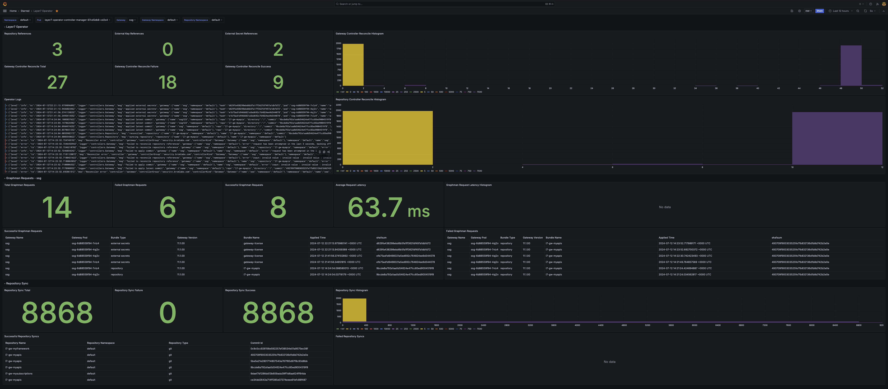

# Layer7 Operator Metrics (OTel)
The Layer7 Operator has basic support for OpenTelemetry Metrics. At this point you should have the Grafana LGTM Stack up and running, return [here](../readme.md#getting-started) if you don't.

## Deploy an OpenTelemetryCollector for the Layer7 Operator
This folder contains an [OpenTelemetry Collector](./collector.yaml) of type Deployment. In this example, no changes are required.
```
kubectl apply -f ./otel-lgtm/layer7-operator/collector.yaml
```

## Configuration
The OpenTelemetry integration is disabled by default, to enable it you will need to set the following environment variables. You can set this in the deployment bundle or simply update your Layer7 Operator deployment.
```
env:
- name: ENABLE_OTEL
  value: "true"
- name: OTEL_EXPORTER_OTLP_ENDPOINT
  value: layer7-operator-collector.default.svc.cluster.local:4317
- name: OTEL_METRIC_PREFIX
  value: layer7_
```

## Update your Layer7 Operator Deployment
The simplest way to configure your Operator Deployment is running the following command

This will automatically update your Operator Pod and if you have the Grafana LGTM stack up and running you should start to see metrics in the Layer7 Operator Dashboard in around a minute
```
kubectl patch deployment layer7-operator-controller-manager -p '{"spec":{"template":{"spec":{"containers":[{"env":[{"name":"ENABLE_OTEL","value":"true"},{"name":"OTEL_EXPORTER_OTLP_ENDPOINT","value":"layer7-operator-collector:4317"},{"name": "OTEL_METRIC_PREFIX","value":"layer7_"}], "name": "manager"}]}}}}'
```

## View your Grafana Dashboard
- Open a browser and navigate to `https://grafana.brcmlabs.com` if you changed the grafana ingress host, navigate to the host that you configured. Accept the certificate warning and proceed to authenticate.
  
  The default username is `admin` with password `7layer`. If you updated the default grafana admin password, use the password that you configured.
- Select the dashboards tab on the left side menu 
  - Expand the Layer7 Folder
  - Open Layer7 Operator Dashboard



### [Return to the Grafana LGTM Example](../readme.md#enabling-otel-metrics-for-the-layer7-operator)


