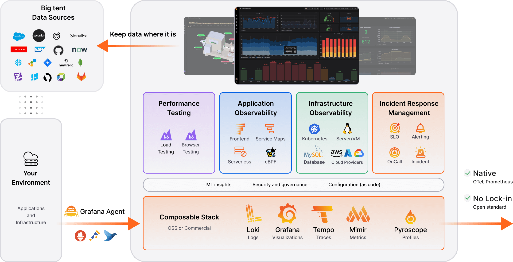
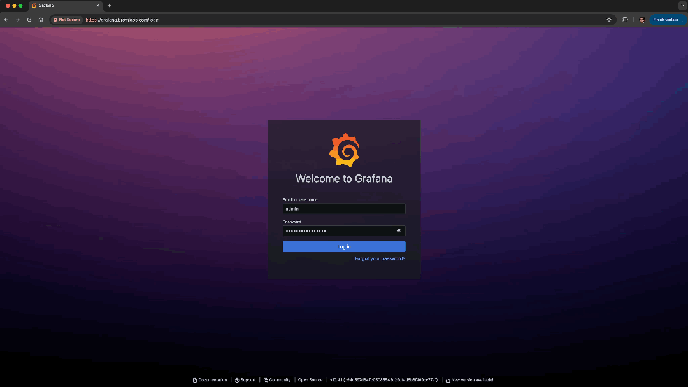
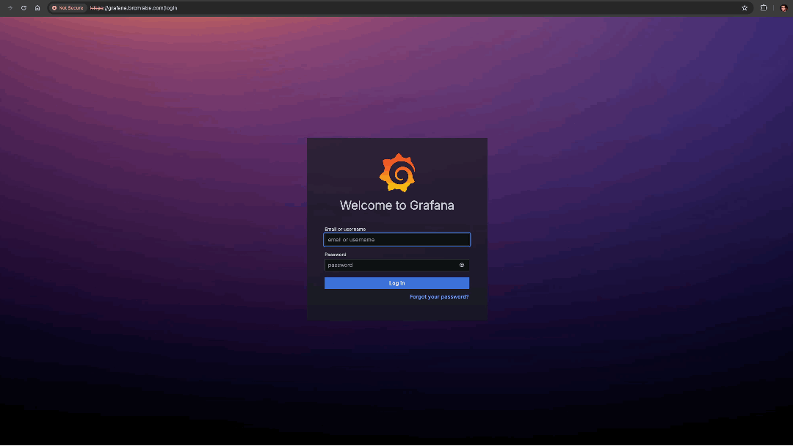

# Deploying the Grafana Stack and Prometheus
This guide details how to deploy the [Grafana LGTM Stack](https://grafana.com/about/grafana-stack/) and the [Prometheus Stack](https://github.com/prometheus-community/helm-charts/tree/main/charts/kube-prometheus-stack) into your Kubernetes cluster. We use public Helm Charts in both stacks that you can refer to and configure

These tools showcase a preview feature with [OpenTelemetry](https://opentelemetry.io/) and the Layer7 API Gateway. Please refer to [Techdocs](https://techdocs.broadcom.com/us/en/ca-enterprise-software/layer7-api-management/api-gateway/11-1/install-configure-upgrade/configuring-opentelemetry-for-the-gateway.html) for more details on how to configure the Gateway for OpenTelemetry.

## Component Overview
As part of this guide we will deploy the following components
- ***L***oki (Logs)
  - Promtail
- ***G***rafana (UI)
- ***T***empo (Traces)
- ***M***imir (Metrics)
- Prometheus Stack (Cluster Monitoring)

***NOTE:*** This guide also includes the OpenTelemetry Operator, while the OpenTelemetry Operator is not a requirement, it makes configuring the Gateway for OpenTelemetry simpler.
- OpenTelemetry Operator
    - Certmanager (dependency)




## Prerequisites
- Kubernetes v1.26+
- Ingress Controller (important for grafana)
  - the quickstart examples deploy the nginx ingress controller

You will also need to add the following entries to your hosts file

If you're running Kind locally
```
127.0.0.1 grafana.brcmlabs.com gateway.brcmlabs.com
```
If you're running Kind on a remote VM
```
<VIRTUAL-MACHINE-IP> grafana.brcmlabs.com gateway.brcmlabs.com
i.e.
192.168.1.40 grafana.brcmlabs.com gateway.brcmlabs.com
```
***NOTE*** If you are using an existing Kubernetes Cluster you can retrieve the correct address after the Prometheus Stack has been deployed

```
kubectl get ingress -n monitoring
```
output
```
NAME                 CLASS   HOSTS                  ADDRESS     PORTS     AGE
prometheus-grafana   nginx   grafana.brcmlabs.com   <ip-address>   80, 443   57m
```
/etc/hosts - the ingress address will be the same for the Gateway Ingress record
```
<ip-address> grafana.brcmlabs.com gateway.brcmlabs.com
```

### Getting started
1. Place a gateway v10 or v11 license in [base/resources/secrets/license/](../base/resources/secrets/license/) called license.xml.
2. Accept the Gateway License
  - license.accept defaults to false in [Gateway examples](../gateway/otel-lgtm-gateway.yaml)
  - update license.accept to true before proceeding
  ```
  license:
    accept: true
    secretName: gateway-license
  ```
3. If you would like to create a TLS secret for your ingress controller then add tls.crt and tls.key to [base/resources/secrets/tls](../base/resources/secrets/tls)
    - these will be referenced later on.
4. You will need an ingress controller like nginx
    - if you do not have one installed already you can use the makefile in the example directory to deploy one
        - ```cd example```
        - Generic Kubernetes
            - ```make nginx```
        - Kind (Kubernetes in Docker)
            - follow the steps in Quickstart
            or
            - ```make nginx-kind```
    - return to the previous folder
        - ```cd ..```

This example uses multiple namespaces for the additional components. Your Kubernetes user or service account must have sufficient privileges to create namespaces, deployments, configmaps, secrets, service accounts, roles, etc.

The following namespaces will be created/used if you use the [quickstart](#quickstart) option to deploy this example
- monitoring (prometheus, grafana)
- grafana-loki (loki, tempo, promtail)
- ingress-nginx (nginx ingress controller)

If you deploy the OpenTelemetry Operator and Certmanager
- cert-manager
- opentelemetry-operator-system

#### Ingress Configuration
- Grafana
If you wish to use a different host and or configure a signed certificate for Grafana, update the ingress configuration in [prometheus-values.yaml](./prometheus/prometheus-values.yaml)
```
grafana:
  ingress:
    enabled: true
    ingressClassName: nginx
    labels: {}
    hosts:
      - grafana.brcmlabs.com
    path: /
    tls:
    - secretName: brcmlabs
      hosts:
      - grafana.brcmlabs.com
```
#### Grafana Admin Password
The default credentials to login to Grafana are `admin/7layer` If you wish to change the default Grafana admin password update the following in [prometheus-values.yaml](./prometheus/prometheus-values.yaml)
```
grafana:
  adminPassword: 7layer
```
- Gateway
If you wish to use a different host and or configure a signed certificate for the Gateway, update the ingress configuration in [otel-lgtm-gateway.yaml](../gateway/otel-lgtm-gateway.yaml)
```
ingress:
  enabled: true
  ingressClassName: nginx
  annotations:
    nginx.ingress.kubernetes.io/backend-protocol: "HTTPS"
    # nginx.ingress.kubernetes.io/ssl-passthrough: "true"
  tls:
  - hosts: 
    - gateway.brcmlabs.com
    secretName: brcmlabs
  rules:
  - host: gateway.brcmlabs.com
```

## Guide
* [Quickstart](#quickstart)
    * [Using Kind](#kind)
    * [Using an existing Kubernetes Cluster](#existing-kubernetes-cluster)
* [Deploy the Prometheus Stack](#deploy-the-prometheus-stack)
* [Deploy the Grafana Stack](#deploy-the-grafana-stack)
* [Deploy the OpenTelemetry Operator](#deploy-the-opentelemetry-operator)
* [Create an OpenTelemetryCollector](#create-an-opentelemetry-collector)
* [Deploy the Layer7 Operator](#deploy-the-layer7-operator)
* [Verify Deployment](#verify-deployment)
* [Test your Gateway](#test-your-gateway-deployment)
* [Uninstall](#uninstall)

## Quickstart
A Makefile is included in the example directory that makes deploying this example a one step process. If you have access to a Docker Machine you can use [Kind](https://kind.sigs.k8s.io/) (Kubernetes in Docker). This example can optionally deploy a Kind Cluster for you (you just need to make sure that you've [installed Kind](https://kind.sigs.k8s.io/docs/user/quick-start/#installation))

The kind configuration is in the base of the example folder. If your docker machine is remote (you are using a VM or remote machine) then uncomment the network section and set the apiServerAddress to the address of your VM/Remote machine
```
kind: Cluster
apiVersion: kind.x-k8s.io/v1alpha4
# networking:
#   apiServerAddress: "192.168.1.64"
#   apiServerPort: 6443
nodes:
- role: control-plane
  kubeadmConfigPatches:
  - |
    kind: InitConfiguration
    nodeRegistration:
      kubeletExtraArgs:
        node-labels: "ingress-ready=true"
  extraPortMappings:
  - containerPort: 80
    hostPort: 80
    protocol: TCP
  - containerPort: 443
    hostPort: 443
    protocol: TCP
```

### Kind
```
make kind-cluster enable-otel-l7operator otel-lgtm-example-kind
```

### Existing Kubernetes Cluster
```
make enable-otel-l7operator otel-lgtm-example 
```
if you don't have an ingress controller you can deploy nginx with the following
```
make nginx
```
if you are using kind
```
make nginx-kind
```

#### Enabling OTel Metrics for the Layer7 Operator
The following command enables Open Telemetry metrics for the layer7 operator. You can read more about this configuration [here](./layer7-operator/readme.md)

This command is run above, you do not need to run it again
```
make enable-otel-l7operator
```

### [Now verify everything is working as expected](#verify-deployment)

##################################################################
### Manual Deployment
##################################################################

## Deploy the Prometheus Stack
We use the following [Helm Chart](https://github.com/prometheus-community/helm-charts/tree/main/charts/kube-prometheus-stack) to deploy Prometheus

- Add the prometheus-community Helm Chart Repo
```
helm repo add prometheus-community https://prometheus-community.github.io/helm-charts
helm repo update
```
- Create the Layer7 Dashboards

The dashboards are located in [./prometheus/grafana-dashboard/](./otel-lgtm/prometheus/grafana-dashboard/) and contain two simple grafana dashboards that get populated with telemetry generated from the Gateway's OpenTelemetry integration. You will find more details about the integration on [Techdocs](https://techdocs.broadcom.com/us/en/ca-enterprise-software/layer7-api-management/api-gateway/11-1/install-configure-upgrade/configuring-opentelemetry-for-the-gateway.html).
```
kubectl apply -k ./otel-lgtm/prometheus/grafana-dashboard/
```
- Deploy the Prometheus Stack
```
helm upgrade -i prometheus -f ./otel-lgtm/prometheus/prometheus-values.yaml prometheus-community/kube-prometheus-stack -n monitoring
```

## Deploy the Grafana Stack
The [Grafana LGTM](https://grafana.com/about/grafana-stack/) (Loki, Grafana, Tempo, Mimir) stack provides a great all in one solution for observing traces, metrics and logs from Kubernetes and other infrastructure. If you would like to manage more than Kubernetes, or more than a single cluster you can check out their cloud offering [here](https://grafana.com/products/cloud/).

In this example, Grafana is configured in the prometheus stack

- Add the grafana Helm Chart Repo
```
helm repo add grafana https://grafana.github.io/helm-charts
helm repo update
```

- Deploy Loki

Loki is deployed via [this Helm Chart](https://github.com/grafana/loki/tree/main/production/helm/loki)
```
helm upgrade --install --values ./otel-lgtm/grafana-stack/loki-overrides.yaml loki grafana/loki -n grafana-loki --create-namespace
```

- Deploy Promtail

Promtail is deployed via [this Helm Chart](https://github.com/grafana/helm-charts/tree/main/charts/promtail)
```
helm upgrade --install --values ./otel-lgtm/grafana-stack/promtail-overrides.yaml promtail grafana/promtail -n grafana-loki
```

- Deploy Tempo

Tempo is deployed via [this Helm Chart](https://github.com/grafana/helm-charts/tree/main/charts/tempo)
```
helm upgrade --install --values ./otel-lgtm/grafana-stack/tempo-overrides.yaml tempo grafana/tempo -n grafana-loki
```

- Deploy Mimir

Mimir is deployed via [this Helm Chart](https://github.com/grafana/helm-charts/tree/main/charts/mimir-distributed)
```
helm upgrade --install --values ./otel-lgtm/grafana-stack/mimir-distributed-overrides.yaml mimir grafana/mimir-distributed -n grafana-loki
```

## Deploy the OpenTelemetry Operator
the OpenTelemetry Operator is not a requirement, it makes configuring the Gateway for OpenTelemetry significantly simpler and works well with this example guide

- Deploy Cert-Manager (OTel Operator dependency)
```
kubectl apply -f https://github.com/cert-manager/cert-manager/releases/download/v1.14.5/cert-manager.yaml
```
verify cert-manager has been successfully deployed
```
kubectl wait --for=condition=ready --timeout=600s pod -l app=cert-manager -n cert-manager
kubectl wait --for=condition=ready --timeout=600s pod -l app=cainjector -n cert-manager
kubectl wait --for=condition=ready --timeout=600s pod -l app=webhook -n cert-manager
```

- Deploy the OpenTelemetry Operator
```
kubectl apply -f https://github.com/open-telemetry/opentelemetry-operator/releases/download/v0.97.1/opentelemetry-operator.yaml
```
verify that the OpenTelemetry Operator has been successfully deployed
```
kubectl wait --for=condition=ready --timeout=600s pod -l app.kubernetes.io/name=opentelemetry-operator -n opentelemetry-operator-system
```

## Create an OpenTelemetry Collector
[OpenTelemetry Collectors](https://opentelemetry.io/docs/collector/) provide a vendor-agnostic way to receive, process and export telemetry data. The OpenTelemetry Operator manages a custom resource called an OpenTelemetryCollector. We define an OpenTelemetry collector for the Gateway [here](./collector.yaml).

In our example we are sending telemetry to the components that we configured earlier, OpenTelemetry is [supported by 20+ vendors](https://opentelemetry.io/ecosystem/vendors/). You are not restricted to this Observability stack, it is highly likely that your existing Observability Platform supports OpenTelemetry.

The Gateway, when configured correctly will have a sidecar automatically injected by the OpenTelemetry Operator based on what we have in this configuration.
```
apiVersion: opentelemetry.io/v1alpha1
kind: OpenTelemetryCollector
metadata:
  name: gateway-opentelemetry-collector
spec:
  ***mode: sidecar***
```

In this example we also have a file called [instrumentation.yaml](./instrumentation.yaml) which facilitates auto-instrumentation of the Gateway Container, this injects an initContainer into the Gateway Deployment that inserts and configures the OpenTelemetry Agent. This is ***optional***, the Layer7 Gateway includes the OpenTelemetry SDK. Including the OpenTelemetry Agent captures additional telemetry including but not limited to JVM Metrics. Please refer to [Techdocs](https://techdocs.broadcom.com/us/en/ca-enterprise-software/layer7-api-management/api-gateway/11-1/install-configure-upgrade/configuring-opentelemetry-for-the-gateway.html) for more details

- Create OpenTelemetry Collector + Instrumentation (required for this example)
```
kubectl apply -f ./otel-lgtm/
```

### Deploy the Layer7 Operator
This step will deploy the Layer7 Operator and all of its resources in namespaced mode. This means that it will only manage Gateway and Repository Custom Resources in the Kubernetes Namespace that it's deployed in.

```
kubectl apply -f https://github.com/CAAPIM/layer7-operator/releases/download/v1.0.6/bundle.yaml
```

#### Open Telemetry Support
The Layer7 Operator has basic support for OpenTelemetry Metrics, if you wish to enable this head [here](./layer7-operator/readme.md#layer7-operator-metrics-otel) to deploy the Operator with OTel enabled.


#### Verify the Operator is up and running
```
kubectl get pods

NAME                                                  READY   STATUS    RESTARTS   AGE
layer7-operator-controller-manager-7647b58697-qd9vg   2/2     Running   0          27s
```

### Create Repository Custom Resources
This example ships with 3 pre-configured Graphman repositories. The repository controller is responsible for synchronising these with the Operator and should always be created before Gateway resources that reference them to avoid race conditions. ***race conditions will be resolved automatically.***

- [l7-gw-myframework](https://github.com/Gazza7205/l7GWMyFramework)
- [l7-gw-mysubscriptions](https://github.com/Gazza7205/l7GWMySubscriptions)
- [l7-gw-myapis](https://github.com/Gazza7205/l7GWMyAPIs)

```
kubectl apply -k ./repositories
```

#### View the Operator Logs
```
kubectl logs -f $(kubectl get pods -oname | grep layer7-operator-controller-manager) manager
```

#### Repository CR
The Repository Controller keeps tracks the latest available commit, where it's stored (if it's less than 1mb we create a Kubernetes secret) and when it was last updated. The Storage Secret is a gzipped graphman bundle (json) used in the Graphman Init Container to remove dependencies on git during deployment.

***Note: If the repository exceeds 1mb in compressed format each Graphman Init Container will clone it at runtime. This represents a single point of failure if your Git Server is down, we recommended creating your own initContainer with the larger graphman bundle.***
```
kubectl get repositories

NAME                    AGE
l7-gw-myapis            10s
l7-gw-myframework       10s
l7-gw-mysubscriptions   10s

kubectl get repository l7-gw-myapis -oyaml
...
status:
  commit: 3791f11c9b588b383ce87535f46d4fc1526ae83b
  name: l7-gw-myapis
  storageSecretName: l7-gw-myapis-repository
  updated: 2023-04-04 02:53:53.298060678 +0000 UTC m=+752.481758238
  vendor: Github
```

#### Create a Gateway Custom Resource
```
kubectl apply -f ./gateway/otel-lgtm-gateway.yaml
```

#### Referencing the repositories we created
[ssg-gateway.yaml](../gateway/otel-lgtm-gateway.yaml) contains 3 repository references, the 'type' defines how a repository is applied to the Container Gateway.
- Dynamic repositories are applied directly to the Graphman endpoint on the Gateway which does not require a gateway restart
- Static repositories are bootstrapped to the Container Gateway with an initContainer which requires a gateway restart.
```
repositoryReferences:
  - name: l7-gw-myframework
    enabled: true
    type: ***static***
    encryption:
      existingSecret: graphman-encryption-secret
      key: FRAMEWORK_ENCRYPTION_PASSPHRASE
  - name: l7-gw-myapis
    enabled: true
    type: ***dynamic***
    encryption:
      existingSecret: graphman-encryption-secret
      key: APIS_ENCRYPTION_PASSPHRASE
  - name: l7-gw-mysubscriptions
    enabled: true
    type: ***dynamic***
    encryption:
      existingSecret: graphman-encryption-secret
      key: SUBSCRIPTIONS_ENCRYPTION_PASSPHRASE
```

#### View your new Gateway
```
kubectl get pods

NAME                                                  READY   STATUS    RESTARTS   AGE
layer7-operator-controller-manager-7647b58697-qd9vg   2/2     Running   0          15m
ssg-57d96567cb-n24g9                                  2/2     Running   0          73s
```

#### Static Graphman Repositories
Because we created the l7-gw-myframework repository reference with type 'static' the Layer7 Operator automatically injects an initContainer to bootstrap the repository to the Container Gateway.
Note: the suffix here graphman-static-init-***c1b58adb6d*** is generated using all static commit ids, if a static repository changes the Gateway will be updated.
```
kubectl describe pods ssg-57d96567cb-n24g9

...
Init Containers:
  graphman-static-init-c1b58adb6d:
    Container ID:   containerd://21924ae85d25437d3634ea5da1415c9bb58d678600f9fd67d4f0b0360857d7c5
    Image:          docker.io/layer7api/graphman-static-init:1.0.0
    Image ID:       docker.io/layer7api/graphman-static-init@sha256:24189a432c0283845664c6fd54c3e8d9f86ad9d35ef12714bb3a18b7aba85aa4
    Port:           <none>
    Host Port:      <none>
    State:          Terminated
      Reason:       Completed
      Exit Code:    0
      Started:      Tue, 04 Apr 2023 04:11:18 +0100
      Finished:     Tue, 04 Apr 2023 04:11:18 +0100
...
```
### View the Graphman InitContainer logs
We should see that our static repository l7-gw-myframework has been picked up and moved to the bootstrap folder.
```
kubectl logs ssg-57d96567cb-n24g9 graphman-static-init-c1b58adb6d

l7-gw-myframework with 40kbs written to /opt/SecureSpan/Gateway/node/default/etc/bootstrap/bundle/graphman/0/0_l7-gw-myframework.json
```

### View the Operator logs
```
kubectl logs -f $(kubectl get pods -oname | grep layer7-operator-controller-manager) manager
```

### Inspect the Status of your Custom Resources

#### Gateway CR
The Gateway Controller tracks gateway pods and the repositories that have been applied to the deployment
```
kubectl get gateway ssg -oyaml

status:
 ...
  gateway:
  - name: ssg-6b7d7fd999-n5bsj
    phase: Running
    ready: true
    startTime: 2023-04-03 18:57:24 +0000 UTC
  host: gateway.brcmlabs.com
  image: caapim/gateway:11.1.1
  ready: 1
  replicas: 1
repositoryStatus:
- branch: main
  commit: c93028b807cf1b62bce0142a80ad4f6203207e8d
  enabled: true
  endpoint: https://github.com/Gazza7205/l7GWMyFramework
  name: l7-gw-myframework
  secretName: graphman-repository-secret
  storageSecretName: l7-gw-myframework-repository
  type: static
- branch: main
  commit: 3791f11c9b588b383ce87535f46d4fc1526ae83b
  enabled: true
  endpoint: https://github.com/Gazza7205/l7GWMyAPIs
  name: l7-gw-myapis
  secretName: graphman-repository-secret
  storageSecretName: l7-gw-myapis-repository
  type: dynamic
- branch: main
  commit: fd6b225159fcd8fccf4bd61e31f40cdac64eccfa
  enabled: true
  endpoint: https://github.com/Gazza7205/l7GWMySubscriptions
  name: l7-gw-mysubscriptions
  secretName: graphman-repository-secret
  storageSecretName: l7-gw-mysubscriptions-repository
  type: dynamic
state: Ready
version: 11.1.1
```

#### Repository CR
The Repository Controller keeps tracks the latest available commit, where it's stored (if it's less than 1mb we create a Kubernetes secret) and when it was last updated.
```
kubectl get repository l7-gw-myapis -oyaml
...
status:
  commit: 7332f861e11612a91ca9de6b079826b9377dae6a
  name: l7-gw-myapis
  storageSecretName: l7-gw-myapis-repository
  updated: 2023-04-06 15:00:20.144406434 +0000 UTC m=+21.758241719
  vendor: Github
```


## Verify Deployment
Confirm all Grafana stack pods are up and running
```
kubectl get pods -n grafana-loki
```
output
```
NAME                                       READY   STATUS      RESTARTS   AGE
loki-0                                     1/1     Running     0          4m
loki-canary-hr5n6                          1/1     Running     0          4m
loki-chunks-cache-0                        2/2     Running     0          4m
loki-gateway-5cd888fb5b-lx68d              1/1     Running     0          4m
loki-minio-0                               1/1     Running     0          4m
loki-results-cache-0                       2/2     Running     0          4m
mimir-alertmanager-0                       1/1     Running     0          2m7s
mimir-compactor-0                          1/1     Running     0          2m7s
mimir-distributor-75db4845b5-fwgx5         1/1     Running     0          2m7s
mimir-ingester-0                           1/1     Running     0          2m7s
mimir-ingester-1                           1/1     Running     0          2m7s
mimir-make-minio-buckets-5.0.14-9ddtx      0/1     Completed   0          2m7s
mimir-minio-66c9c9446c-vr6tx               1/1     Running     0          2m7s
mimir-nginx-6c54df9bbf-xw5wm               1/1     Running     0          2m7s
mimir-overrides-exporter-75c74b879-l4vd2   1/1     Running     0          2m7s
mimir-querier-f4c7668c7-c2lkr              1/1     Running     0          2m7s
mimir-query-frontend-86f49bdd54-57njx      1/1     Running     0          2m7s
mimir-query-scheduler-9c9db55-ns8bw        1/1     Running     0          2m7s
mimir-rollout-operator-589445cccd-2gktd    1/1     Running     0          2m7s
mimir-ruler-87b575f97-xxv8z                1/1     Running     0          2m7s
mimir-store-gateway-0                      1/1     Running     0          2m7s
promtail-92scb                             1/1     Running     0          3m25s
tempo-0                                    1/1     Running     0          3m17s
```

- Confirm all datasources are configured correctly in Grafana
    - Open a browser and navigate to `https://grafana.brcmlabs.com` if you changed the grafana ingress host, navigate to the host that you configured. Accept the certificate warning and proceed to authenticate.
      
      The default username is `admin` with password `7layer`. If you updated the default grafana admin password, use the password that you configured.
    - Select the datasources tab on the left side menu and proceed to test them.
      - Loki
      - Prometheus
      - Tempo

    The animated gif below depicts the process you will need to follow.

    

### Test your Gateway Deployment
```
kubectl get ingress

NAME   CLASS   HOSTS                  ADDRESS        PORTS     AGE
ssg    nginx   gateway.brcmlabs.com   34.89.126.80   80, 443   54m
```

Add the following to your hosts file for DNS resolution
```
Format
$ADDRESS $HOST

example
34.89.126.80 gateway.brcmlabs.com
```
Curl
```
curl https://gateway.brcmlabs.com/api1 -H "client-id: D63FA04C8447" -k
```
Response
```
{
  "client" : "D63FA04C8447",
  "plan" : "plan_a",
  "service" : "hello api 1",
  "myDemoConfigVal" : "suspiciousLlama"
}
```

### View the Gateway Dashboard in Grafana
- Open a browser and navigate to `https://grafana.brcmlabs.com` if you changed the grafana ingress host, navigate to the host that you configured. Accept the certificate warning and proceed to authenticate.
  
  The default username is `admin` with password `7layer`. If you updated the default grafana admin password, use the password that you configured.
- Select the dashboards tab on the left side menu 
  - Expand the Layer7 Folder
  - Open Gateway Dashboard

The animated gif below depicts the process you will need to follow.



### Uninstall
If you used the Quickstart option and deployed Kind, all you will need to do is remove the Kind Cluster.

Make sure that you're in the example folder
```
pwd
```
output
```
/path/to/layer7-operator/example
```

If you used kind
```
make uninstall-kind
```
If you used an existing Kubernetes Cluster
```
make uninstall
```

- If you deployed nginx

If you used kind
```
make uninstall-nginx-kind
```
If you used an existing Kubernetes Cluster
```
make uninstall-nginx
```
