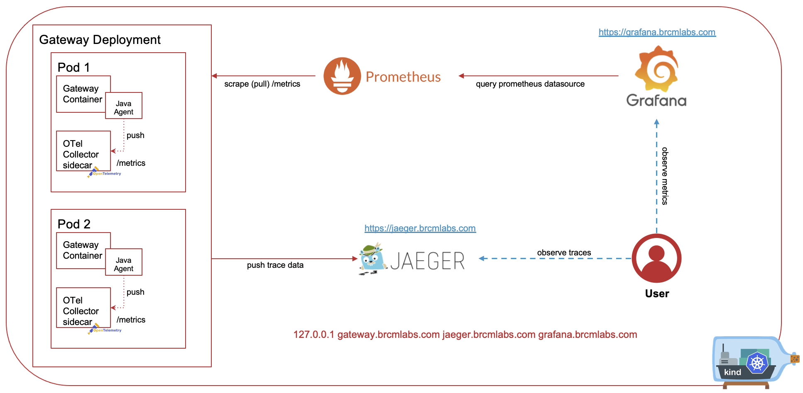
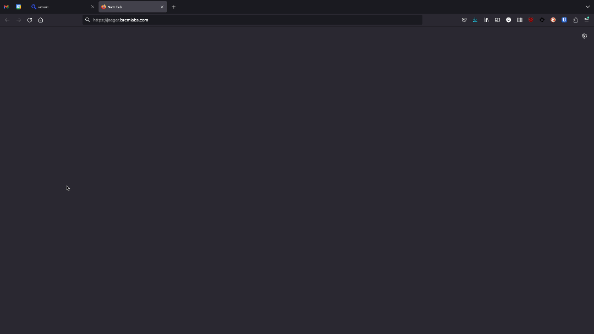
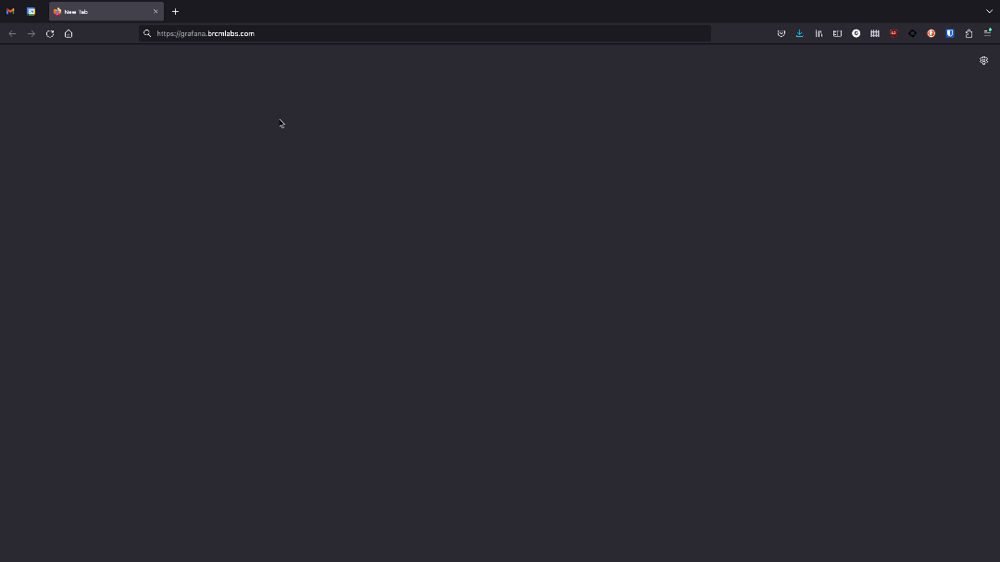

# Open Telemetry Integration (Prometheus)
By the end of this example you should have a better understanding of the how to utilise the Gateway's Open Telemetry integration to increase observability across your Operator Managed Gateways. This example uses a Simple Gateway as a base and includes installing the following.

- CertManager Operator (required for OTel)
- OpenTelemetry Operator
- Prometheus Stack
- Nginx (Ingress Controller)
- Jaeger



## Prerequisites
- Kubernetes v1.25+
- Gateway v10/11.x License
- Ingress Controller (You can also expose Gateway Services as L4 LoadBalancers)

The OTel Example requires multiple namespaces for the additional components. Your Kubernetes user or service account must have sufficient privileges to create namespaces, deployments, configmaps, secrets, service accounts, roles, etc.

***NOTE:*** to keep things simple we use the default namespace when creating namespaced resources including the Layer7 Operator, Gateway, Repositories and Prometheus Service Monitor. If you'd like to use a different namespace then you will need to update the following.

- [servicemonitor.yaml](../otel-gateway/servicemonitor.yaml)
```
apiVersion: monitoring.coreos.com/v1
kind: ServiceMonitor
metadata:
  labels:
    app: ssg
  name: ssg
spec:
  endpoints:
  - interval: 10s
    path: /metrics
    port: monitoring
  jobLabel: ssg
  namespaceSelector:
    matchNames:
    - default ==> change this to your namespace
  selector:
    matchLabels:
      app.kubernetes.io/created-by: layer7-operator
      app.kubernetes.io/managed-by: layer7-operator
      app.kubernetes.io/name: ssg
      app.kubernetes.io/part-of: ssg
```

- [prometheus-values.yaml](../otel/monitoring/prometheus/prometheus-values.yaml)
```
prometheusOperator:
  namespaces:
    releaseNamespace: true
    additional:
    - kube-system
    - layer7
    - default
    - addyournamespacehere
...
```

- Update your Kubectl context
```
kubectl config set-context --current --namespace=yournamespace
```

If you have a docker machine available you can use [Kind](https://kind.sigs.k8s.io/) to try out this example!

### Getting started
1. Place a gateway v10 or v11 license in [base/resources/secrets/license/](../base/resources/secrets/license/) called license.xml.
2. If you would like to create a TLS secret for your ingress controller then add tls.crt and tls.key to [base/resources/secrets/tls](../base/resources/secrets/tls)
    - these will be referenced later on.

### Gateway Configuration
- [Container Gateway](#container-gateway-configuration)
- [OTel Collector](#otel-collector-configuration)
- [Service Monitor](#service-monitor-configuration)
- [Gateway Application](#gateway-application-configuration)
- [Service Level](#service-level-configuration)

### Guide
- [Quickstart Kind](#quickstart-kind)
- [Quickstart Existing Kubernetes Cluster](#quickstart-existing-cluster)

### Monitoring/Observability Components
- [Install Cert Manager](#install-cert-manager)
- [Install Open Telemetry](#install-open-telemetry)
- [Install Prometheus](#install-prometheus)
- [Install Jaeger](#install-jaeger)
- [Install an Ingress Controller(optional)](#install-nginx)

### Layer7 Operator
- [Deploy the Operator](#deploy-the-layer7-operator)
- [Create Repositories](#create-repository-custom-resources)
- [Create a Gateway](#create-a-gateway-custom-resource)
- [Test Gateway Deployment](#test-your-gateway-deployment)
- [Remove Custom Resources](#remove-custom-resources)
- [Uninstall the Operator CRs](#uninstall-the-operator)

#### Container Gateway Configuration
The container gateway configuration required for this integration is relatively simple. We will set some [environment variables](../base/resources/secrets/gateway/secret.env) that the Otel Agent present on the Container Gateway will use to send logs, traces and metrics to the Otel Collector sidecar.

```
OTEL_EXPORTER_OTLP_ENDPOINT=http://localhost:4317 ==> exposed by the Otel Sidecar (or otc-container)
OTEL_METRICS_EXPORTER=otlp
OTEL_TRACES_EXPORTER=otlp
OTEL_SERVICE_NAME=ssg
OTEL_RESOURCE_ATTRIBUTES=gateway.name=ssg,service.name=ssg,service.version=10.1.00_CR3,deployment.environment=development
```

We also need to expose a monitoring endpoint so that Prometheus can scrape the Gateway service
```
service:
  type: LoadBalancer
  ports:
  ...
  - name: monitoring
    port: 8889
    protocol: TCP
```

### OTel Collector Configuration
The OpenTelemetry Operator will automatically inject a sidecar into the Gateway Pod with our [OTel configuration](../otel/collector.yaml). This configuration exposes a /metrics endpoint on the Gateway Pod on port 8889 for Prometheus to scrape.

```
receivers:
  otlp:
    protocols:
      grpc:
      http:
processors:
  batch:
exporters:
  logging:
    loglevel: warn 
  prometheus:
    endpoint: "0.0.0.0:8889"
    const_labels:
      name: ssg
  jaeger:
    endpoint: simple-allinone-collector:14250
    tls:
      insecure: true
service:
  telemetry:
    logs:
      level: "debug"
    metrics:
      address: "0.0.0.0:8888"
  pipelines:
    traces:
      receivers: [otlp]
      processors: [batch]
      exporters: [jaeger]
    metrics:
      receivers: [otlp]
      processors: [batch]
      exporters: [prometheus, logging]
    logs: 
      receivers: [otlp]
      exporters: [logging]
extensions:
  health_check:
  pprof:
    endpoint: 0.0.0.0:1777
  zpages:
    endpoint: 0.0.0.0:55679
```

#### Service Monitor Configuration
We need to tell Prometheus about the /metrics endpoint on the Gateway pod, we do this with a [ServiceMonitor](../otel-gateway/servicemonitor.yaml)

```
apiVersion: monitoring.coreos.com/v1
kind: ServiceMonitor
metadata:
  labels:
    app: ssg
  name: ssg
spec:
  endpoints:
  - interval: 10s ==> time between scrapes
    path: /metrics ==> the time 
    port: monitoring
  jobLabel: ssg
  namespaceSelector:
    matchNames:
    - default ==> if you are not using the default namespace you will need to update this
  selector:
    matchLabels:
      app.kubernetes.io/created-by: layer7-operator
      app.kubernetes.io/managed-by: layer7-operator
      app.kubernetes.io/name: ssg
      app.kubernetes.io/part-of: ssg
```

#### Gateway Application Configuration
The Gateway requires Otel specific cluster-wide properties and an additional java arg for the OTel agent.

- Java Args
```
java:
  ...
  extraArgs:
  ...
  - -javaagent:/opt/SecureSpan/Gateway/runtime/lib/otel/opentelemetry-javaagent-1.21.0.jar
```

- Cluster-Wide Properties
```
cwp:
  enabled: true
  properties:
    ...
    - name: otel.enabled
      value: "true"
    - name: otel.serviceMetricEnabled ==> enable/disable service metrics
      value: "true"
    - name: otel.traceEnabled ==> enable/disable traces
      value: "true"
    - name: otel.metricPrefix ==> custom metrics get this prefix
      value: l7_
    - name: otel.resourceAttributes
      value: gateway.name=ssgNode.Name,service.name=ssg,service.version=10.1.00,deployment.environment=development
    - name: otel.traceConfig ==> trace config allows you to switch on tracing for a specific API(s) by service URI
      value: |
        {
         "services": [
           {"url": ".*api.*"}
         ],
         "serviceTraceDetail": "Request - ${request.parameter.name}",
         "policyTraceDetail" : "Count - ${someCtxVar}"
        } 
```


#### Service Level Configuration
The [global-graphman-bundle.json](../otel-gateway/global-graphman-bundle.json) contains a message-completed policy with a single Telemetry Metric assertion. This collects generic service level information that we use to populate the Grafana Dashboard. In our example we use message-completed because it only requires a change in one place, the Telemetry metric assertion can also be inserted into an existing service(s) to capture service specific metrics at any point that you wish to monitor.

```
{
    "globalPolicies": [
      {
        "name": "message-completed",
        "folderPath": "/global",
        "goid": "278f6d2cbeb3e0e3b0d9cde605c8a711",
        "guid": "b3ef3421-8151-4f85-99f8-1dacc7d65748",
        "tag": "message-completed",
        "checksum": "570bbce5b1062a17479465574ce046633823cebe",
        "policy": {
          "xml": "..."
        }
      }
    ]
  }
```

#### Quickstart Kind
A Makefile is included in the example directory that makes deploying this example a one step process. If you have access to a Docker Machine you can use [Kind](https://kind.sigs.k8s.io/) (Kubernetes in Docker). This example can optionally deploy a Kind Cluster for you (you just need to make sure that you've [installed Kind](https://kind.sigs.k8s.io/docs/user/quick-start/#installation))

The kind configuration is in the base of the example folder. If your docker machine is remote (you are using a VM or remote machine) then uncomment the network section and set the apiServerAddress to the address of your VM/Remote machine
```
kind: Cluster
apiVersion: kind.x-k8s.io/v1alpha4
# networking:
#   apiServerAddress: "192.168.1.64"
#   apiServerPort: 6443
nodes:
- role: control-plane
  kubeadmConfigPatches:
  - |
    kind: InitConfiguration
    nodeRegistration:
      kubeletExtraArgs:
        node-labels: "ingress-ready=true"
  extraPortMappings:
  - containerPort: 80
    hostPort: 80
    protocol: TCP
  - containerPort: 443
    hostPort: 443
    protocol: TCP
```

This process takes a few minutes to complete

- navigate to the example directory
```
cd example
```
- deploy the example
```
make kind-cluster otel-example-kind
```
You will also need to add the following entries to your hosts file
```
127.0.0.1 gateway.brcmlabs.com jaeger.brcmlabs.com grafana.brcmlabs.com
```

You can now move on to test your gateway deployment!
- [Test Gateway Deployment](#test-your-gateway-deployment)

#### Quickstart Existing Cluster
This quickstart uses the Makefile to install of the necessary components into your Kubernetes Cluster.

- navigate to the example directory
```
cd example
```
- deploy the example
```
make otel-example 
```

If you don't already have an ingress controller you can deploy nginx with the following command
```
make nginx
```
- Once nginx has been installed get the L4 LoadBalancer address
```
kubectl get svc -n ingress-nginx
```
output
```
NAME                                 TYPE           CLUSTER-IP       EXTERNAL-IP     PORT(S)                      AGE
ingress-nginx-controller             LoadBalancer   10.152.183.52    192.168.1.190   80:30183/TCP,443:30886/TCP   24m
ingress-nginx-controller-admission   ClusterIP      10.152.183.132   <none>          443/TCP                      24m
```
- You probably don't have access to a DNS server for this demo so you will need to add the following entries to your hosts file
```
EXTERNAL-IP gateway.brcmlabs.com jaeger.brcmlabs.com grafana.brcmlabs.com

example
192.168.1.190 gateway.brcmlabs.com jaeger.brcmlabs.com grafana.brcmlabs.com
```

You can now move on to test your gateway deployment!
- [Test Gateway Deployment](#test-your-gateway-deployment)

#### Install Cert Manager
These steps are based the official documentation for installing Cert-Manager [here](https://cert-manager.io/docs/installation/). Cert-Manager is a pre-requisite for the Open Telemetry Operator.


- Deploy the Cert Manager Operator
```
kubectl apply -f https://github.com/cert-manager/cert-manager/releases/download/v1.11.0/cert-manager.yaml
```

##### View CertManager Components
```
kubectl get all -n cert-manager

NAME                                          READY   STATUS    RESTARTS   AGE
pod/cert-manager-cainjector-5fcd49c96-r97pk   1/1     Running   0          34s
pod/cert-manager-6ffb79dfdb-thpft             1/1     Running   0          34s
pod/cert-manager-webhook-796ff7697b-5gbzw     1/1     Running   0          34s

NAME                           TYPE        CLUSTER-IP       EXTERNAL-IP   PORT(S)    AGE
service/cert-manager           ClusterIP   10.152.183.216   <none>        9402/TCP   34s
service/cert-manager-webhook   ClusterIP   10.152.183.85    <none>        443/TCP    34s

NAME                                      READY   UP-TO-DATE   AVAILABLE   AGE
deployment.apps/cert-manager-cainjector   1/1     1            1           34s
deployment.apps/cert-manager              1/1     1            1           34s
deployment.apps/cert-manager-webhook      1/1     1            1           34s

NAME                                                DESIRED   CURRENT   READY   AGE
replicaset.apps/cert-manager-cainjector-5fcd49c96   1         1         1       34s
replicaset.apps/cert-manager-6ffb79dfdb             1         1         1       34s
replicaset.apps/cert-manager-webhook-796ff7697b     1         1         1       34s
```


#### Install Open Telemetry
These steps are based the official documentation for installing Open Telemetry [here](https://cert-manager.io/docs/installation/). Open Telemetry depends on cert-manager, ***make sure that cert-manager is running before installing open telemetry.***

- Install the Open Telemetry Operator.
```
kubectl apply -f https://github.com/open-telemetry/opentelemetry-operator/releases/download/v0.76.1/opentelemetry-operator.yaml
```
- Create an OpenTelemetryCollector resource
```
kubectl apply -f ./example/otel/collector.yaml
```

##### View Open Telemetry Components
```
kubectl get all -n opentelemetry-operator-system

NAME                                                                READY   STATUS    RESTARTS      AGE
pod/opentelemetry-operator-controller-manager-5d84764d4b-6zdtb      2/2     Running   18 (8d ago)   28d

NAME                                                                TYPE        CLUSTER-IP    EXTERNAL-IP   PORT(S)    AGE
service/opentelemetry-operator-controller-manager-metrics-service   ClusterIP   10.68.1.93    <none>        8443/TCP   72d
service/opentelemetry-operator-webhook-service                      ClusterIP   10.68.3.243   <none>        443/TCP    72d

NAME                                                                READY   UP-TO-DATE   AVAILABLE   AGE
deployment.apps/opentelemetry-operator-controller-manager           1/1     1            1           72d

NAME                                                                   DESIRED   CURRENT   READY   AGE
replicaset.apps/opentelemetry-operator-controller-manager-5d84764d4b   1         1         1       72d
```

#### Install the Prometheus Stack
These steps are based on instructions that can be found in the Prometheus Community Helm Chart [documentation](https://github.com/prometheus-community/helm-charts/tree/main/charts/prometheus).

- Add the Prometheus Community Helm Chart repository
```
helm repo add prometheus-community https://prometheus-community.github.io/helm-charts
helm repo update
```
- Create a namespace called monitoring
```
kubectl create ns monitoring
```
- Create the Layer7 Grafana Dashboard
```
kubectl apply -k ./example/otel/monitoring/grafana/
```
- Install the Prometheus Helm Chart in the monitoring namespace
```
helm upgrade -i prometheus -f ./example/otel/monitoring/prometheus/prometheus-values.yaml prometheus-community/kube-prometheus-stack -n monitoring
```

#### Install Jaeger
These steps are based on instructions that can be found in the Jaeger [documentation](https://www.jaegertracing.io/docs/1.44/operator/)

- Create a namespace called observability
```
kubectl create namespace observability
```
- Install the Jaeger Operator
```
kubectl create -f https://github.com/jaegertracing/jaeger-operator/releases/download/v1.44.0/jaeger-operator.yaml -n observability
```

#### View Jaeger Components
```
kubectl get all -n observability

NAME                                      READY   STATUS    RESTARTS   AGE
pod/jaeger-operator-6cf68b6f65-z8jtv      2/2     Running   0          16s

NAME                                      TYPE        CLUSTER-IP    EXTERNAL-IP   PORT(S)    AGE
service/jaeger-operator-metrics           ClusterIP   10.68.15.46   <none>        8443/TCP   17s
service/jaeger-operator-webhook-service   ClusterIP   10.68.1.180   <none>        443/TCP    17s

NAME                                      READY   UP-TO-DATE   AVAILABLE   AGE
deployment.apps/jaeger-operator           1/1     1            1           17s

NAME                                         DESIRED   CURRENT   READY   AGE
replicaset.apps/jaeger-operator-6cf68b6f65   1         1         1       17s
```

- Deploy a Jaeger Custom Resource
```
kubectl apply -f ./example/otel/observability/jaeger/jaeger.yaml
```

- Create an ingress resource for Jaeger.
```
kubectl apply -f ./example/otel/observability/jaeger/ingress.yaml
```


#### Install Nginx
This command will deploy an nginx ingress controller. If you already have nginx or another ingress controller running in your Kubernetes cluster you can safely ignore this step.

```
kubectl apply -f https://raw.githubusercontent.com/kubernetes/ingress-nginx/main/deploy/static/provider/cloud/deploy.yaml
```

#### 

#### Deploy the Layer7 Operator
This step will deploy the Layer7 Operator and all of its resources in namespaced mode. This means that it will only manage Gateway and Repository Custom Resources in the Kubernetes Namespace that it's deployed in.

```
kubectl apply -f deploy/bundle.yaml
```

##### Verify the Operator is up and running
```
kubectl get pods

NAME                                                  READY   STATUS    RESTARTS   AGE
layer7-operator-controller-manager-7647b58697-qd9vg   2/2     Running   0          27s
```

#### Create Repository Custom Resources
This example ships with 3 pre-configured Graphman repositories. The repository controller is responsible for synchronising these with the Operator and should always be created before Gateway resources that reference them to avoid race conditions. ***race conditions will be resolved automatically.***

- [l7-gw-myframework](https://github.com/Gazza7205/l7GWMyFramework)
- [l7-gw-mysubscriptions](https://github.com/Gazza7205/l7GWMySubscriptions)
- [l7-gw-myapis](https://github.com/Gazza7205/l7GWMyAPIs)

```
kubectl apply -k example/repositories

secret/gateway-license configured
secret/gateway-secret unchanged
secret/graphman-encryption-secret unchanged
secret/graphman-repository-secret configured
secret/harbor-reg-cred configured
repository.security.brcmlabs.com/l7-gw-myapis created
repository.security.brcmlabs.com/l7-gw-myframework created
repository.security.brcmlabs.com/l7-gw-mysubscriptions created
```

##### Operator Logs
```
kubectl logs <layer7-operator-pod> manager

...
1.6805762965185595e+09 INFO controllers.Repository Creating Storage Secret {"Name": "l7-gw-myapis-repository", "Namespace": "layer7"}
1.6805762965343177e+09 INFO controllers.Repository Reconciled {"Name": "l7-gw-myapis", "Namespace": "layer7", "Commit": "3791f11c9b588b383ce87535f46d4fc1526ae83b"}
1.680576296929594e+09 INFO controllers.Repository Creating Storage Secret {"Name": "l7-gw-myframework-repository", "Namespace": "layer7"}
1.6805762969402978e+09 INFO controllers.Repository Reconciled {"Name": "l7-gw-myframework", "Namespace": "layer7", "Commit": "c93028b807cf1b62bce0142a80ad4f6203207e8d"}
1.6805762973589563e+09 INFO controllers.Repository Creating Storage Secret {"Name": "l7-gw-mysubscriptions-repository", "Namespace": "layer7"}
1.6805762973709154e+09 INFO controllers.Repository Reconciled {"Name": "l7-gw-mysubscriptions", "Namespace": "layer7", "Commit": "fd6b225159fcd8fccf4bd61e31f40cdac64eccfa"} 
...

```

##### Repository CR
The Repository Controller keeps tracks the latest available commit, where it's stored (if it's less than 1mb we create a Kubernetes secret) and when it was last updated. The Storage Secret is a gzipped graphman bundle (json) used in the Graphman Init Container to remove dependencies on git during deployment.

***Note: If the repository exceeds 1mb in compressed format each Graphman Init Container will clone it at runtime. This represents a single point of failure if your Git Server is down, we recommended creating your own initContainer with the larger graphman bundle.***
```
kubectl get repositories

NAME                    AGE
l7-gw-myapis            10s
l7-gw-myframework       10s
l7-gw-mysubscriptions   10s

kubectl get repository l7-gw-myapis -oyaml
...
status:
  commit: 3791f11c9b588b383ce87535f46d4fc1526ae83b
  name: l7-gw-myapis
  storageSecretName: l7-gw-myapis-repository
  updated: 2023-04-04 02:53:53.298060678 +0000 UTC m=+752.481758238
  vendor: Github
```

#### Create a Gateway Custom Resource
```
kubectl apply -k example/otel-gateway/

serviceaccount/ssg-serviceaccount created
secret/gateway-license configured
secret/gateway-secret configured
secret/graphman-bootstrap-bundle configured
secret/graphman-encryption-secret configured
secret/graphman-repository-secret configured
secret/restman-bootstrap-bundle configured
gateway.security.brcmlabs.com/ssg created

```

##### Referencing the repositories we created
[ssg-gateway.yaml](./ssg-gateway.yaml) contains 3 repository references, the 'type' defines how a repository is applied to the Container Gateway.
- Dynamic repositories are applied directly to the Graphman endpoint on the Gateway which does not require a gateway restart
- Static repositories are bootstrapped to the Container Gateway with an initContainer which requires a gateway restart.
```
repositoryReferences:
  - name: l7-gw-myframework
    enabled: true
    type: ***static***
    encryption:
      existingSecret: graphman-encryption-secret
      key: FRAMEWORK_ENCRYPTION_PASSPHRASE
  - name: l7-gw-myapis
    enabled: true
    type: ***dynamic***
    encryption:
      existingSecret: graphman-encryption-secret
      key: APIS_ENCRYPTION_PASSPHRASE
  - name: l7-gw-mysubscriptions
    enabled: true
    type: ***dynamic***
    encryption:
      existingSecret: graphman-encryption-secret
      key: SUBSCRIPTIONS_ENCRYPTION_PASSPHRASE
```

##### View your new Gateway
```
kubectl get pods

NAME                                                  READY   STATUS    RESTARTS   AGE
layer7-operator-controller-manager-7647b58697-qd9vg   2/2     Running   0          15m
ssg-57d96567cb-n24g9                                  2/2     Running   0          73s
```

##### Static Graphman Repositories
Because we created the l7-gw-myframework repository reference with type 'static' the Layer7 Operator automatically injects an initContainer to bootstrap the repository to the Container Gateway.
Note: the suffix here graphman-static-init-***c1b58adb6d*** is generated using all static commit ids, if a static repository changes the Gateway will be updated.
```
kubectl describe pods ssg-57d96567cb-n24g9

...
Init Containers:
  graphman-static-init-c1b58adb6d:
    Container ID:   containerd://21924ae85d25437d3634ea5da1415c9bb58d678600f9fd67d4f0b0360857d7c5
    Image:          docker.io/layer7api/graphman-static-init:1.0.0
    Image ID:       docker.io/layer7api/graphman-static-init@sha256:24189a432c0283845664c6fd54c3e8d9f86ad9d35ef12714bb3a18b7aba85aa4
    Port:           <none>
    Host Port:      <none>
    State:          Terminated
      Reason:       Completed
      Exit Code:    0
      Started:      Tue, 04 Apr 2023 04:11:18 +0100
      Finished:     Tue, 04 Apr 2023 04:11:18 +0100
...
```
##### View the Graphman InitContainer logs
We should see that our static repository l7-gw-myframework has been picked up and moved to the bootstrap folder.
```
kubectl logs ssg-57d96567cb-n24g9 graphman-static-init-c1b58adb6d

l7-gw-myframework with 40kbs written to /opt/SecureSpan/Gateway/node/default/etc/bootstrap/bundle/graphman/0/0_l7-gw-myframework.json
```

##### View the Operator logs
```
kubectl logs layer7-operator-controller-manager-7647b58697-qd9vg manager

...
1.6805472375519047e+09  INFO    Starting workers        {"controller": "gateway", "controllerGroup": "security.brcmlabs.com", "controllerKind": "Gateway", "worker count": 1}
1.6805472375519912e+09  INFO    Starting workers        {"controller": "repository", "controllerGroup": "security.brcmlabs.com", "controllerKind": "Repository", "worker count": 1}
1.6805480463029926e+09  INFO    controllers.Gateway     Creating ConfigMap      {"Name": "ssg", "Namespace": "layer7"}
1.680548046309193e+09   INFO    controllers.Gateway     Creating ConfigMap      {"Name": "ssg-system", "Namespace": "layer7"}
1.6805480463136642e+09  INFO    controllers.Gateway     Creating ConfigMap      {"Name": "ssg-cwp-bundle", "Namespace": "layer7"}
1.6805480463188894e+09  INFO    controllers.Gateway     Creating ConfigMap      {"Name": "ssg-listen-port-bundle", "Namespace": "layer7"}
1.680548046426919e+09   INFO    controllers.Gateway     Creating Service        {"Name": "ssg", "Namespace": "layer7"}
1.6805480465468638e+09  INFO    controllers.Gateway     Deployment hasn't been created yet      {"Name": "ssg", "Namespace": "layer7"}
1.6805480466609669e+09  INFO    controllers.Gateway     Creating ConfigMap      {"Name": "ssg-repository-init-config", "Namespace": "layer7"}
1.6805480466660128e+09  INFO    controllers.Gateway     Creating Deployment     {"Name": "ssg", "Namespace": "layer7"}
1.6805480472615528e+09  INFO    controllers.Repository  Creating Storage Secret {"Name": "l7-gw-myframework", "Namespace": "layer7"}
1.680548047275876e+09   INFO    controllers.Repository  Reconciled      {"Name": "l7-gw-myframework", "Namespace": "layer7", "Commit": "4b6c3ff1f174e4095ceadb31153392084fbaa61b"}
1.6805786502375867e+09  INFO    controllers.Gateway     Applying Latest Commit  {"Repo": "l7-gw-myapis", "Directory": "/", "Commit": "3791f11c9b588b383ce87535f46d4fc1526ae83b", "Pod": "ssg-57d96567cb-n24g9", "Name": "ssg", "Namespace": "layer7"}
1.6805786509813132e+09  INFO    controllers.Gateway     Applying Latest Commit  {"Repo": "l7-gw-mysubscriptions", "Directory": "/", "Commit": "fd6b225159fcd8fccf4bd61e31f40cdac64eccfa", "Pod": "ssg-57d96567cb-n24g9", "Name": "ssg", "Namespace": "layer7"}
...

```

##### Inspect the Status of your Custom Resources

###### Gateway CR
The Gateway Controller tracks gateway pods and the repositories that have been applied to the deployment
```
kubectl get gateway ssg -oyaml

status:
 ...
  gateway:
  - name: ssg-6b7d7fd999-n5bsj
    phase: Running
    ready: true
    startTime: 2023-04-03 18:57:24 +0000 UTC
  host: gateway.brcmlabs.com
  image: caapim/gateway:10.1.00_CR3
  ready: 1
  replicas: 1
repositoryStatus:
- branch: main
  commit: c93028b807cf1b62bce0142a80ad4f6203207e8d
  enabled: true
  endpoint: https://github.com/Gazza7205/l7GWMyFramework
  name: l7-gw-myframework
  secretName: graphman-repository-secret
  storageSecretName: l7-gw-myframework-repository
  type: static
- branch: main
  commit: 3791f11c9b588b383ce87535f46d4fc1526ae83b
  enabled: true
  endpoint: https://github.com/Gazza7205/l7GWMyAPIs
  name: l7-gw-myapis
  secretName: graphman-repository-secret
  storageSecretName: l7-gw-myapis-repository
  type: dynamic
- branch: main
  commit: fd6b225159fcd8fccf4bd61e31f40cdac64eccfa
  enabled: true
  endpoint: https://github.com/Gazza7205/l7GWMySubscriptions
  name: l7-gw-mysubscriptions
  secretName: graphman-repository-secret
  storageSecretName: l7-gw-mysubscriptions-repository
  type: dynamic
state: Ready
version: 10.1.00_CR3
```

###### Repository CR
The Repository Controller keeps tracks the latest available commit, where it's stored (if it's less than 1mb we create a Kubernetes secret) and when it was last updated.
```
kubectl get repository l7-gw-myapis -oyaml
...
status:
  commit: 7332f861e11612a91ca9de6b079826b9377dae6a
  name: l7-gw-myapis
  storageSecretName: l7-gw-myapis-repository
  updated: 2023-04-06 15:00:20.144406434 +0000 UTC m=+21.758241719
  vendor: Github
```

##### Test your Gateway Deployment
```
kubectl get ingress

NAME   CLASS   HOSTS                  ADDRESS        PORTS     AGE
ssg    nginx   gateway.brcmlabs.com   34.89.126.80   80, 443   54m
```

Add the following to your hosts file for DNS resolution
```
Format
$ADDRESS $HOST

example
34.89.126.80 gateway.brcmlabs.com
```
Curl
```
curl https://gateway.brcmlabs.com/api1 -H "client-id: D63FA04C8447" -k
```
```
{
  "client" : "D63FA04C8447",
  "plan" : "plan_a",
  "service" : "hello api 1",
  "myDemoConfigVal" : "Mondays"
}
```

##### Sign into Policy Manager
Policy Manager access is less relevant in a deployment like this because we haven't specified an external MySQL database, any changes that we make will only apply to the Gateway that we're connected to and won't survive a restart. It is still useful to check what's been applied. We configured custom ports where we disabled Policy Manager access on 8443, we're also using an ingress controller meaning that port 9443 is not accessible without port forwarding.

Port-Forward
```
kubectl get pods
NAME                   READY   STATUS    RESTARTS   AGE
...
ssg-7698bc565b-szrbj   1/1     Running   0          54m

kubectl port-forward ssg-7698bc565b-szrbj 9443:9443
```
Policy Manager
```
username: admin
password: 7layer
gateway: localhost:9443
```

#### Access Jaeger
Jaeger has been configured via ingress which should resolve to https://jaeger.brcmlabs.com. You can use Jaeger to view assertion level traces of the test policy we just tested with curl.




#### Access Grafana
Grafana has been configured via ingress which should resolve to https://grafana.brcmlabs.com. You can use Grafana to view Gateway service level + general metrics of your Gateway Deployment.

```
username: admin
password: 7layer
```


#### Remove Custom Resources
If you used the Kind example
```
make uninstall-kind
```

If you used your own Kubernetes Cluster
```
make uninstall
```

You can also run all of these steps manually. 

```
kubectl delete -k ./example/otel-gateway
kubectl delete -k ./example/repositories/
kubectl delete -f ./example/otel/collector.yaml
kubectl delete -f ./example/otel/observability/jaeger/jaeger.yaml
kubectl delete -f https://raw.githubusercontent.com/kubernetes/ingress-nginx/main/deploy/static/provider/cloud/deploy.yaml
kubectl delete -f https://github.com/open-telemetry/opentelemetry-operator/releases/latest/download/opentelemetry-operator.yaml
kubectl delete -f https://github.com/cert-manager/cert-manager/releases/download/v1.11.0/cert-manager.yaml
helm uninstall prometheus -n monitoring
kubectl delete -k ./example/otel/monitoring/grafana/
kubectl delete ns monitoring
kubectl delete ns observability
```

### Uninstall the Operator
```
kubectl delete -f deploy/bundle.yaml

customresourcedefinition.apiextensions.k8s.io "gateways.security.brcmlabs.com" deleted
customresourcedefinition.apiextensions.k8s.io "repositories.security.brcmlabs.com" deleted
serviceaccount "layer7-operator-controller-manager" deleted
role.rbac.authorization.k8s.io "layer7-operator-leader-election-role" deleted
role.rbac.authorization.k8s.io "layer7-operator-manager-role" deleted
role.rbac.authorization.k8s.io "layer7-operator-proxy-role" deleted
rolebinding.rbac.authorization.k8s.io "layer7-operator-leader-election-rolebinding" deleted
rolebinding.rbac.authorization.k8s.io "layer7-operator-manager-rolebinding" deleted
rolebinding.rbac.authorization.k8s.io "layer7-operator-proxy-rolebinding" deleted
configmap "layer7-operator-manager-config" deleted
service "layer7-operator-controller-manager-metrics-service" deleted
deployment.apps "layer7-operator-controller-manager" deleted
```