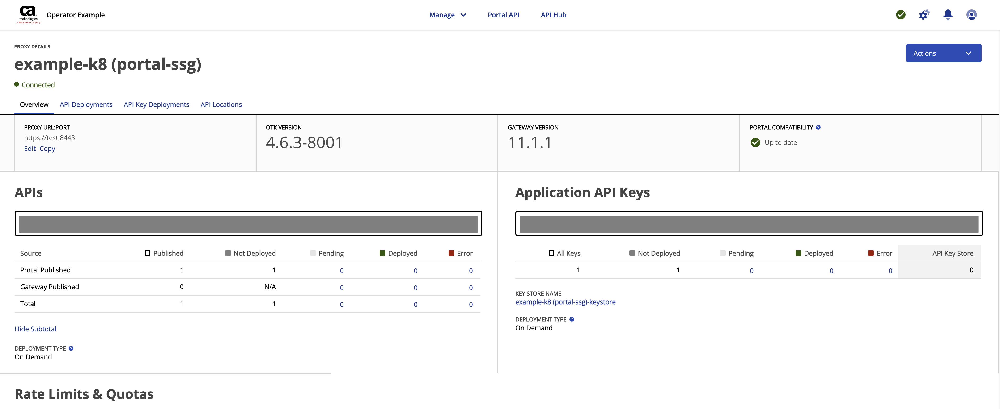

# Portal Integration
By the end of this example you should have a better understanding of the Layer7 Operator <==> Portal Integration. This example introduces the L7Portal and L7Api custom resources.

**NOTE** this example is experimental only! It **should not** be used in Portal deployments, and does not carry any official Broadcom support.


### Getting started
1. Place a gateway v11 license in [example/base/resources/secrets/license/](../base/resources/secrets/license/) called license.xml.
2. Place the registry credential for the Portal images in [example/portal-integration/secrets](../portal-integration/secrets/) called docker-secret.yaml available on the [CA API Developer Portal Solutions & Patches](https://techdocs.broadcom.com/us/product-content/recommended-reading/technical-document-index/ca-api-developer-portal-solutions-and-patches.html) page.
3. Accept the Gateway License
  - license.accept defaults to false in [Gateway examples](../gateway/portal-gateway.yaml)
  - update license.accept to true before proceeding
  ```
  license:
    accept: true
    secretName: gateway-license
  ```
4. Resources
   - You will need a machine that is capable of running the Portal Core stack and the Gateway
     - At a minimum you should have 8(v)cpu and 16GB RAM allocated to your Kind instance or Kubernetes node.
5. DNS/Host file configuration
   - You will need the following entries in your hosts file or local DNS
     If you're running Kind locally
     ```
     127.0.0.1 gateway.brcmlabs.com portal.brcmlabs.com apim-dev-portal.brcmlabs.com dev-portal-ssg.brcmlabs.com dev-portal-enroll.brcmlabs.com dev-portal-sync.brcmlabs.com dev-portal-sso.brcmlabs.com dev-portal-analytics.brcmlabs.com dev-portal-broker.brcmlabs.com
     ```
     If you're running Kind on a remote VM
     ```
     <VIRTUAL-MACHINE-IP> gateway.brcmlabs.com portal.brcmlabs.com apim-dev-portal.brcmlabs.com dev-portal-ssg.brcmlabs.com dev-portal-enroll.brcmlabs.com dev-portal-sync.brcmlabs.com dev-portal-sso.brcmlabs.com dev-portal-analytics.brcmlabs.com dev-portal-broker.brcmlabs.com
     i.e.
     192.168.1.40 gateway.brcmlabs.com portal.brcmlabs.com apim-dev-portal.brcmlabs.com dev-portal-ssg.brcmlabs.com dev-portal-enroll.brcmlabs.com dev-portal-sync.brcmlabs.com dev-portal-sso.brcmlabs.com dev-portal-analytics.brcmlabs.com dev-portal-broker.brcmlabs.com
     ```
     ***NOTE*** If you are using an existing Kubernetes Cluster you can retrieve the correct address after the Prometheus Stack has been deployed

     ```
     kubectl get ingress
     ```
     output
     ```
     NAME                 CLASS   HOSTS                                                                                                    ADDRESS        PORTS     AGE
     portal-ingress       nginx   apim-dev-portal.brcmlabs.com,dev-portal-ssg.brcmlabs.com,dev-portal-analytics.brcmlabs.com + 5 more...   <ip-address>   80, 443   57m
     ```
     In your hosts file - the ingress address will be the same for the Gateway Ingress record
     ```
     <ip-address> gateway.brcmlabs.com portal.brcmlabs.com apim-dev-portal.brcmlabs.com dev-portal-ssg.brcmlabs.com dev-portal-enroll.brcmlabs.com dev-portal-sync.brcmlabs.com dev-portal-sso.brcmlabs.com dev-portal-analytics.brcmlabs.com dev-portal-broker.brcmlabs.com
     ```

     - We recommend sticking with the defaults to try out this experimental example as they are used to provision a Portal Tenant
       - If you wish to change the default you can do so in [portal-values.yaml](../portal-integration/portal-values.yaml)
         - set portal.domain
         ```yaml
         ...
         portal:
           domain: yourportaldomain.com
         ...
         ```
         - Your hosts file will need to use yourportaldomain.com in place of brcmlabs.com
         - The [enroll-payload](./enroll-payload.json) will also need to be updated
6. You will need an ingress controller like nginx
    - if you do not have one installed already you can use the makefile in the example directory to deploy one
        - ```cd example```
        - Generic Kubernetes
            - ```make nginx```
        - Kind (Kubernetes in Docker)
            - follow the steps in [Quickstart](#quickstart)
            or
            - ```make nginx-kind```
    - **NOTE:** the Portal requires an ingress controller that supports ssl/tls passthrough for mutual ssl/tls.
        - This will add the following [command line argument](https://kubernetes.github.io/ingress-nginx/user-guide/cli-arguments/) to nginx, in the ingress-nginx namespace. **It has only been tested** deployed with the above commands
        - ```--enable-ssl-passthrough```
        - The following command will edit your nginx deployment
            - ```make configure-nginx-ssl-passthrough```


### Guide
- This guide targets the default namespace for the layer7, operator, gateway, portal and redis. This can be updated by setting the following environment variable
```
export NAMESPACE=yournamespace
```
- We don't specify a namespace for the manual steps or commands to view different resources, if you aren't using the default namespace you can update your current namespace with the following command
```
kubectl config set-context --current --namespace=yournamespace
```

If you deploy the nginx ingress controller as part of this example, it will use a namespace called ingress-nginx

* [Quickstart](#quickstart)
    * [Using an existing Kubernetes Cluster](#existing-kubernetes-cluster)
    * [Using Kind](#kind)
- [Manual Steps](#manual-steps)
  - [Deploy Redis](#deploy-redis)
  - [Deploy the Developer Portal](#deploy-the-developer-portal)
  - [Deploy the Operator](#deploy-the-layer7-operator)
  - [Create a Gateway](#create-a-gateway)
- [Configure the Developer Portal](#configure-the-developer-portal)
  - [Connect to the Developer Portal](#connect-to-the-developer-portal)
  - [Create an API](#create-an-api)
  - [Create an Application](#create-an-application)
  - [Create an Environment (Kubernetes Proxy)](#create-an-environment)
  - [Deploy the G2C(Ground 2 Cloud) Agent](#deploy-the-g2c-ground-2-cloud-agent)
  - [Deploy Application and API](#deploy-application-and-api)
  - [Test your API](#test-your-api)
- [Cleanup](#cleanup)
  - [Remove Kind Cluster](#remove-kind-cluster)
  - or
  - [Uninstall components](#uninstall)

## Quickstart
A Makefile is included in the example directory that makes deploying this example a one step process. If you have access to a Docker Machine you can use [Kind](https://kind.sigs.k8s.io/) (Kubernetes in Docker). This example can optionally deploy a Kind Cluster for you (you just need to make sure that you've [installed Kind](https://kind.sigs.k8s.io/docs/user/quick-start/#installation))

The kind configuration is in the base of the example folder. If your docker machine is remote (you are using a VM or remote machine) then uncomment the network section and set the apiServerAddress to the address of your VM/Remote machine
```
kind: Cluster
apiVersion: kind.x-k8s.io/v1alpha4
# networking:
#   apiServerAddress: "192.168.1.64"
#   apiServerPort: 6443
nodes:
- role: control-plane
  kubeadmConfigPatches:
  - |
    kind: InitConfiguration
    nodeRegistration:
      kubeletExtraArgs:
        node-labels: "ingress-ready=true"
  extraPortMappings:
  - containerPort: 80
    hostPort: 80
    protocol: TCP
  - containerPort: 443
    hostPort: 443
    protocol: TCP
```

Navigate to the example folder
```
cd example
```

### Kind
```
make kind-cluster nginx-kind configure-nginx-ssl-passthrough portal-example
```

### Existing Kubernetes Cluster
An ingress controller is required for this example, if you don't have an ingress controller you can deploy nginx with the following
```
make nginx configure-nginx-ssl-passthrough
```
if you are using kind
```
make nginx-kind configure-nginx-ssl-passthrough
```
Deploy the example components
```
make portal-example
```

## If you used the Makefile proceed to [Configure the Developer Portal](#configure-the-developer-portal)

### Deploy Redis
This integration does not use the traditional OTK database, instead Portal writes keys to a central Redis deployment that the Gateway uses to verify application keys. Redis is deployed using the [Bitnami Redis Helm Chart](https://github.com/bitnami/charts/tree/main/bitnami/redis) to its own namespace called redis. See [redis-values.yaml](../portal-integration/redis/redis-values.yaml) for more details on how it is configured.

You can deploy redis using the makefile
```
make redis
```
or manually
```
helm upgrade -i standalone -f ./portal-integration/redis/redis-values.yaml oci://registry-1.docker.io/bitnamicharts/redis
kubectl wait --for=condition=ready --timeout=600s pod -l app.kubernetes.io/name=redis
```
View Redis Pod
```
kubectl get pods
```

### Deploy the Developer Portal
The Portal is based on 5.2.3 with custom images for dispatcher, db-upgrade and portal-data. These faciliate creating a Kubernetes Proxy. The Portal is deployed to the default namespace and uses the following [portal-values.yaml](../portal-integration/portal-values.yaml)

You can deploy the portal using the following commands
```
helm repo add layer7 https://caapim.github.io/apim-charts/
helm repo update
helm upgrade --install portal --set ingress.create=false --set-file portal.registryCredentials=./portal-integration/secrets/docker-secret.yaml -f ./portal-integration/portal-values.yaml layer7/portal
kubectl wait --for=condition=ready --timeout=600s pod -l app=apim
```

#### Provision a Portal Tenant
The following script will provision a Portal Tenant with the configuration in [enroll-payload.json](../portal-integration/enroll-payload.json).

```
./portal-integration/create-tenant.sh -d ./portal-integration/enroll-payload.json
```
output
```
your enrollment endpoint is https://dev-portal-ssg.brcmlabs.com:443/provision/tenants
Enrollment key retrieved


        The tenant has been added to the database. The tenant info can be found in the tenant_info file in the current directory.
        Please follow the rest of the instructions at TechDocs to enroll your gateway with the portal.
        (https://techdocs.broadcom.com/us/en/ca-enterprise-software/layer7-api-management/api-developer-portal/5-2/install-configure-and-upgrade/post-installation-tasks/enroll-a-layer7-api-gateway.html)

        1. You will need to navigate to the portal at https://portal.brcmlabs.com and create a new API PROXY. 
        2. Copy the enrollment URL
        3. Open your tenant gateway and enroll this gateway with the portal using the URL from step 2.
```
**Note** if this step fails, there are two likely scenarios
1. You have not configured nginx for ssl/tls passthrough. Please see step 4 in [getting-started](#getting-started)
2. You have not configured your local hosts file. Please see step 6 in [getting-started](#getting-started)


<!-- #### Configure the Portal to use Redis
The following script connects to the Portal MySQL Database and adds two entries (REDIS_GROUP_NAME, REDIS_KEY_STORE) to the SETTING table, this faciliates the Portal using Redis for application keys.
```
./portal-integration/configure-portal.sh
```
output
```
Portal Configured to use Redis
``` -->

### Deploy the Layer7 Operator
This integration example uses v1.1.1 of the Layer7 Operator
```
kubectl apply -f https://github.com/CAAPIM/layer7-operator/releases/download/v1.1.1/bundle.yaml -n ${NAMESPACE}
kubectl wait --for=condition=ready --timeout=600s pod -l app.kubernetes.io/name=layer7-operator
```

### Create a Gateway
The [Gateway Custom Resource](../gateway/portal-gateway.yaml) is configured to use Redis and Gateway version 11.0.00_CR2

Make sure that you've accepted the license in [portal-gateway.yaml](../gateway/portal-gateway.yaml) and placed a gateway v11 license in [example/base/resources/secrets/license/](../base/resources/secrets/license/) called license.xml.
```
kubectl apply -k ./base
```
output
```
serviceaccount/ssg-serviceaccount created
secret/gateway-license created
secret/gateway-secret created
secret/global-bundle created
secret/graphman-bootstrap-bundle created
secret/graphman-encryption-secret created
secret/graphman-repository-secret created
secret/restman-bootstrap-bundle created
secret/service-bootstrap-bundle created
secret/telemetry-bootstrap-bundle created
```

Create the Gateway Custom Resource
```
kubectl apply -f ./gateway/portal-gateway.yaml
```

##### View your new Gateway
```
kubectl get pods | grep portal-ssg
NAME                   READY   STATUS    RESTARTS   AGE
...
portal-ssg-7698bc565b-qrz5g   1/1     Running   0          2m45s
```

##### View the Operator logs
In a separate terminal tab run the following command to tail the Layer7 Operator log
```
kubectl logs -f -l app.kubernetes.io/name=layer7-operator
```

## Configure the Developer Portal
Now that all of the Required Components have been deployed we can proceed to configure the Developer Portal. Make sure that you've followed step 6 in [getting-started](#getting-started) and the required portal domains are in your local hosts file.

### Connect to the Developer Portal
1. Open a browser (Google Chrome is recommended) and navigate to https://portal.brcmlabs.com
2. Accept the certificate warnings
  - if you do not see an option to proceed anyway you can type the following in Google Chrome
    - `thisisunsafe`
3. Login
  - username: admin
  - password: 7layer


### Create an API
This example includes a sample API definition and a simple mock server that you can call to test the integration.

In the same browser
- Click 'Manage' in the center of the top navigation bar.
- Click 'APIs'
- Click 'Add API' (top right)
- Upload a definition file
  - you will upload [shipping-oas.json](../portal-integration/openapi-spec/shipping-oas.json)
- Set 'Location of API' to
  - https://mock.brcmlabs.com/shipping
- Set 'Access' to
  - `Public`
- Set 'API EULA' to
  - `Standard EULA`
- Set 'API URI' to
  - `api/v1/shipping` <== **Do not prefix this with /**
- Uncheck * wildcard
- Click 'Save and Next'
- On the next page
  - Expand 'Default Category'
    - Add Policy Template
      - Select `Standard Policy Template - API Key`
- Click 'Save and Next'
- On the next page
  - Set 'Authentication Type' to API Key
- Click 'Save and Next'
- Click 'Save and Next' again
- On the next page
  - Add the shipping tag
- Click 'Save'


### Create an Application
We will now create an Application and API Key that will be used to authorize access to our Shipping API. **Note** that this Key will be written to Redis, not the traditional Gateway OTK database.

In the same browser
- Click 'Manage' in the center of the top navigation bar.
- Click 'Applications'
- Click 'Add Application' (top right)
- Give the Application a Name
  - `Example App`
- Select the `Sample Org` Organization
- Click 'Save'
- Click the 'APIs' tab
- Click 'Add API'
- Select `Shipping API`
  - Click the Access slider on the right
- Click 'Save'
- Click 'Accept and Save'
- Click the 'Key Overview' tab
- Click 'Add Key'
- Set a Key Name
  - `Example Key`
- Click 'Save Key'
- Click 'Close'
- Click 'Publish'


### Create an Environment
In the same browser
- Click 'Manage' in the center of the top navigation bar.
- Click 'Environment'
- Set 'CLOUD NATIVE ENVIRONMENT' to
  - `example-k8` <== in the experimental version of this integration the name needs to include k8
- Set 'Workspace' (namespace). If you are not using the default namespace, use the namespace you selected earlier
  - `default`
- Set 'Deployment Tags' (these target Operator Managed Gateways)
  - `portal-ssg`
- Click 'Save'
- Click the 'Proxies' tab
- Click 'example-k8 (portal-ssg)'
- Copy the Enrollment URL
- Keep this tab open for later
- Modify [g2c-agent/agent.env](./g2c-agent/agent.env)
  - ENROLMENT_ENDPOINT=Copied Enrollment URL
  - Example
  ```
  ENROLMENT_ENDPOINT=https://dev-portal-enroll.brcmlabs.com:443/enroll/portal/?sckh=jacg-kDSrS50zujw6QsPwqd-Lw1TuW7eoEagV0_8SpY&token=3acb385f-5d65-47ea-ab2f-51f15369de43
  ```


### Deploy the G2C (Ground 2 Cloud) Agent
Make sure that you set the ENROLMENT_ENDPOINT above

- Deploy the agent
```
make g2c-agent
```
- View the agent logs
```
kubectl logs -f -l app=portal-g2c-agent
```
output
```
info: 2024/11/05 17:03:42 broker: wss://dev-portal-broker.brcmlabs.com:443
portal proxy uuid: dd5a958c-83ce-43dc-9fd8-72aa95bad8fb
info: 2024/11/05 17:03:42 Connected to wss://dev-portal-broker.brcmlabs.com:443
```

- Verify the agent is connected
  - To verify that the agent is connected head back to the Portal and refresh the page that you copied the enrolment url from



### Deploy Application and API
In the same browser

Deploy your Application to your new Kubernetes Proxy
- Click 'Manage' in the center of the top navigation bar.
- Click 'Applications'
- Click 'Example App'
- Click the 'Key Deployments' tab
- Deploy to the example-k8 Proxy
  - Click 'Deploy'

Deploy your API to your new Kubernetes Proxy
- Click 'Manage' in the center of the top navigation bar.
- Click 'APIs'
- Click 'Shipping API'
- Click the 'Deployments' tab
- Deploy to the example-k8 Proxy
  - Click 'Deploy'


### View Custom Resources
The Portal will create two resources in Kubernetes, an l7Portal (created when you defined your environment) and an l7Api (created when you published your API)

#### View the L7Portal
```
kubectl get l7portal example-k8 -oyaml
```
output
```
apiVersion: security.brcmlabs.com/v1alpha1
kind: L7Portal
metadata:
  creationTimestamp: "2024-11-05T17:12:14Z"
  generation: 1
  labels:
    app.kubernetes.io/created-by: layer7-operator
    app.kubernetes.io/managed-by: layer7-operator
    app.kubernetes.io/name: example-k8
    app.kubernetes.io/part-of: example-k8
  name: example-k8
  namespace: default
  resourceVersion: "6402"
  uid: 624b8dcf-8a4d-420b-b1f5-2bda83c4488f
spec:
  auth: {}
  deploymentTags:
  - portal-ssg
  enabled: true
status:
  apiCount: 1
  apiSummaryConfigMap: example-k8-api-summary
  checksum: 95055983a37f8783a4defa7e884305c7abe3e9a2
  enrollmentBundle: {}
  lastUpdated: 1730826734793
```

#### View the L7Api
```
kubectl get l7api shipping-api -oyaml
```
output
```
apiVersion: security.brcmlabs.com/v1alpha1
kind: L7Api
metadata:
  annotations:
    app.l7.deployedBy: admin
    app.l7.deployedTime: "2024-11-05T14:44:03.183406120Z"
    app.l7.traceId: 7b7b48073d9f914c697e0d49d4a4d4c1
    checksum/bundle: "0"
  creationTimestamp: "2024-11-05T14:39:02Z"
  finalizers:
  - security.brcmlabs.com/finalizer
  generation: 2
  labels:
    app.kubernetes.io/created-by: layer7-operator
    app.kubernetes.io/managed-by: layer7-operator
    app.kubernetes.io/name: shipping-api
    app.kubernetes.io/part-of: shipping-api
    app.l7.deployedBy: admin
    app.l7.deployedTime: 2024-11-05T14.44.03.183382375Z
    app.l7.traceId: 7b7b48073d9f914c697e0d49d4a4d4c1
  name: shipping-api
  namespace: default
  resourceVersion: "3852"
  uid: c278e9df-0299-4056-a877-a039db6f1bef
spec:
  deploymentTags:
  - portal-ssg
  l7Portal: example-k8
  portalMeta:
    apiId: f1c01ea463ba483cb187d27820976f5e
    apiUuid: f1c01ea4-63ba-483c-b187-d27820976f5e
    createTs: 1730817277977
    enabled: true
    locationUrl: https://mock.brcmlabs.com/shipping
    modifyTs: 1730817666872
    name: Shipping API
    policyEntities:
    - policyEntityUuid: 72093738-871a-45bd-b114-ad3a61893ac0
      policyTemplateArguments:
      - name: sslEnabled
        value: "true"
    publishedTs: 1730817284494
    serviceId: 01b9e60b-0f15-379d-a818-5bf55b870307
    ssgServiceType: REST
    ssgUrl: api/v1/shipping
    ssgUrlEncoded: YXBpL3YxL3NoaXBwaW5n
    tenantId: portal
  portalPublished: true
status:
  checksum: 7b7b48073d9f914c697e0d49d4a4d4c1
  gateways:
  - checksum: 7b7b48073d9f914c697e0d49d4a4d4c1
    deployment: portal-ssg
    name: portal-ssg-5f96ddfddd-rb4gr
  ready: true
```

### Test your API
Test the Shipping API

We are using a self-signed certificate for the Gateway, we will need to accept the certificate warning before we can successfully test our API
- Open a new browser tab
  - Navigate to https://gateway.brcmlabs.com/api/v1/shipping
  - Accept the Certificate warning
  - if you do not see an option to proceed anyway you can type the following in Google Chrome
    - `thisisunsafe`
  - You should see `Invalid API Key` as a response

- Switch back to the Portal tab in your browser or navigate to `https://portal.brcmlabs.com/admin/`
- Click 'Manage' in the center of the top navigation bar.
- Click 'APIs'
- Click 'Shipping API'
- Click 'Spec'
- Set Application to
  - `Example App`
- Set API Key to
  - `Example Key`
- Expand `GET /api/v1/shipping`
  - Click `Try it out`
  - Click `Execute`
- You should have the following response body
```
{
  "consignments": [
    {
      "additionalServices": [
        {
          "id": "EVARSLING"
        },
        {
          "id": "POSTOPPKRAV"
        }
      ],
      "addressLine": "Testsvingen 2",
      "fromCountryCode": "NO",
      "fromPostalCode": "0015",
      "id": 101,
      "packages": [
        {
          "grossWeight": 50,
          "height": 10,
          "id": "10",
          "length": 10,
          "width": 10
        },
        {
          "grossWeight": 50,
          "height": 10,
          "id": "11",
          "length": 10,
          "width": 10
        },
        {
          "grossWeight": 50,
          "height": 10,
          "id": "12",
          "length": 11,
          "width": 10
        }
      ],
      "products": [
        {
          "id": "SERVICEPAKKE"
        }
      ],
      "shippingDate": {
        "day": "10",
        "hour": "10",
        "minute": "0",
        "month": "10",
        "year": "2016"
      },
      "toCountryCode": "NO",
      "toPostalCode": "5518"
    }
  ],
  "edi": true,
  "language": "no",
  "numberOfAlternativeDeliveryDates": 0,
  "postingAtPostOffice": true,
  "trace": true,
  "withExpectedDelivery": false,
  "withGuiInformation": true,
  "withPrice": true,
  "withUniqueAlternateDeliveryDates": false
}
```


## Cleanup

### Remove Kind Cluster
If you used the Quickstart option and deployed Kind, all you will need to do is remove the Kind Cluster.

Make sure that you're in the example folder
```
pwd
```

output
```
/path/to/layer7-operator/example
```

Remove the Kind Cluster
```
make uninstall-kind
```

#### or


### Uninstall
```
helm del portal 
kubectl delete statefulset portal-mysql
kubectl delete pvc data-portal-mysql-0 data-rabbitmq-0
helm del redis
kubectl delete -f https://github.com/CAAPIM/layer7-operator/releases/download/v1.1.1/bundle.yaml -n ${NAMESPACE}
```